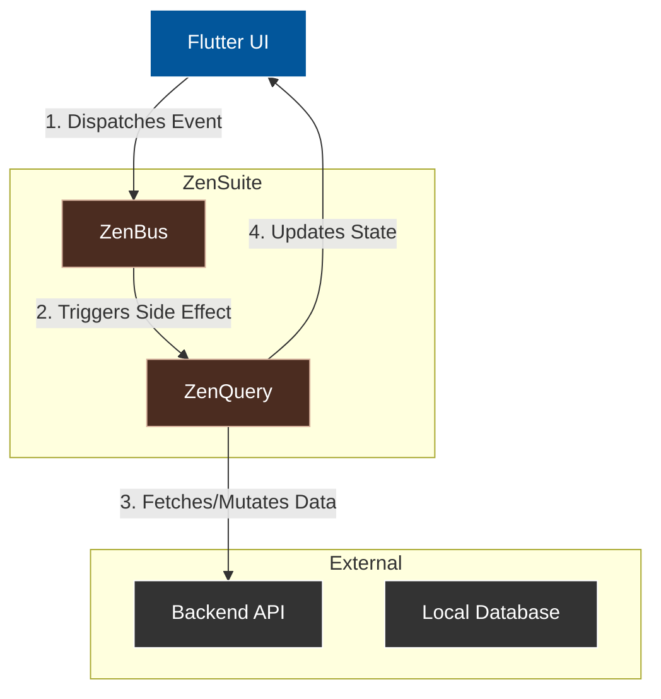

# ZenSuite

[](https://dart.dev)
[](https://flutter.dev)
[](https://opensource.org/licenses/MIT)

**The opinionated, high-performance data flow architecture for Flutter.**

ZenSuite provides a cohesive set of tools for building scalable, type-safe, and performant Flutter applications. It separates concerns into two powerful pillars: **Event-Driven Communication** and **Asynchronous State Management**.

---

## 🏛️ Architecture

ZenSuite decouples your application logic by separating *events* (ZenBus) from *data state* (ZenQuery).



---

## 📦 Packages

| Package | Version | Description |
|---------|---------|-------------|
| **[ZenBus](./packages/zenbus)** | [](https://pub.dev/packages/zenbus) | Blazing-fast event bus with `Stream` and `AlienSignals` engines. |
| **[ZenQuery](./packages/zenquery)** | [](https://pub.dev/packages/zenquery) | Async state management wrapper around Riverpod. |

### [ZenBus](./packages/zenbus)
*High-performance event bus.*
- 🚀 **Fast**: Up to 51x faster than standard Streams.
- 🎯 **Type-Safe**: Generic event handling.
- 🧠 **Efficient**: Zero-overhead memory usage.

### [ZenQuery](./packages/zenquery)
*Async state management.*
- 🔄 **Standardized**: Stores, Queries, and Mutations.
- ∞ **Infinite Scroll**: Native support for pagination.
- 🔮 **Optimistic Updates**: Immediate UI feedback.

---

## � Getting Started

ZenSuite is a monorepo. You can use packages individually or together.

1. **Add dependencies**:
   ```yaml
   dependencies:
     zenbus: ^1.0.0
     zenquery: ^1.0.0
   ```

2. **Setup your root provider** (if using ZenQuery):
   ```dart
   void main() {
     runApp(
       ProviderScope(
         child: MyApp(),
       ),
     );
   }
   ```

3. **Explore the docs**:
   - [ZenBus Documentation](./packages/zenbus/README.md)
   - [ZenQuery Documentation](./packages/zenquery/README.md)

---

## 🤝 Contributing

We welcome contributions! This is a monorepo managed with simple workspace structure.

1. **Clone the repo**:
   ```bash
   git clone https://github.com/definev/zensuite.git
   ```

2. **Install dependencies**:
   ```bash
   dart pub get
   ```

3. **Run tests**:
   ```bash
   cd packages/zenbus && flutter test
   cd packages/zenquery && flutter test
   ```

## � License

MIT © [Bui Dai Duong](https://github.com/definev)
