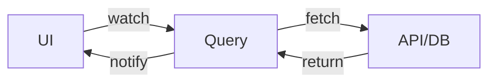
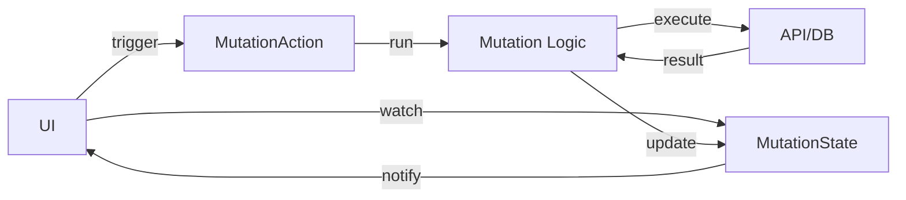
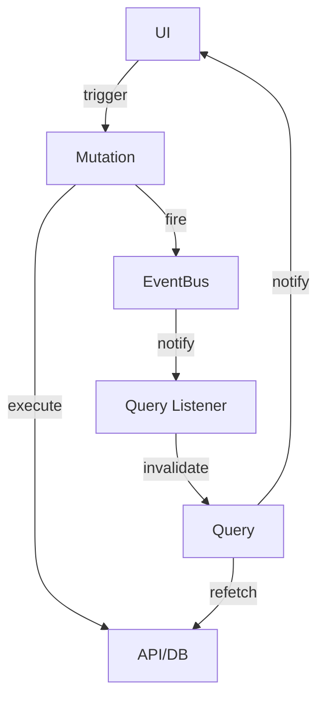
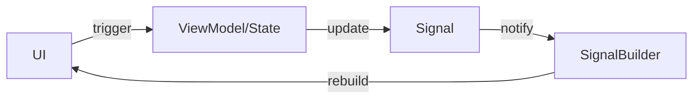

# QMS + EventBus Architecture

QMS + EventBus (QMSE) Architecture is a flat, lean, AI-friendly architecture for Flutter apps. It helps your team organize the codebase in a maintainable way and scale linearly without mental overhead trade-offs.

QMSE Architecture doesn't treat common infrastructure (network, local storage, etc.) as "core" but as modules. QMSE only provides a set of primitives to build the app, making it very flexible and easier to learn from the start.

## Philosophy

### The Problem with Traditional Architectures

Most architectures act as a **mold** for your app. They prescribe rigid structures where *every* feature **must** be implemented in a specific way:

- **Clean Architecture**: Forces you through UseCase → Repository → DataSource layers even for simple features
- **BLoC Pattern**: Requires Event → BLoC → State boilerplate for every interaction
- **MVVM/MVI**: Demands ViewModel/Intent layers regardless of complexity

This looks elegant in blog posts and conference talks. But in practice, it becomes a **nightmare** to maintain because:

1. **Real apps have unique needs**: A chat feature needs different patterns than a payment flow
2. **Not all features are equal**: Fetching user profile shouldn't need the same ceremony as complex workflows
3. **Boilerplate explodes**: Simple changes require touching 5+ files across multiple layers
4. **Fighting the framework**: You spend time satisfying the architecture instead of solving problems

### The QMSE Approach: Guide, Not Mold

A good architecture should act as a **guide**, not a mold. It provides **primitives** and **patterns** but lets you choose how to apply them.

**QMSE gives you building blocks**:
- Use Query for data fetching
- Use Mutation for actions
- Use Store for dependencies
- Use EventBus to decouple components

**But doesn't mandate how**: A simple screen might only use Queries. A complex workflow might use all four. A settings page might skip EventBus entirely. **The architecture adapts to your feature, not vice versa.**

### Practical Flexibility

Here's how QMSE stays flexible:

**Simple Feature** (User Profile):
```dart
// Just a query - no Repository needed!
final userProfileQuery = createQuery<UserProfile>((ref) async {
  final response = await dio.get('/api/users/me');
  return UserProfile.fromJson(response.data);
});

// Use in UI
class ProfileView extends ConsumerWidget {
  Widget build(context, ref) {
    final profile = ref.watch(userProfileQuery);
    return profile.when(...);
  }
}
```

**Complex Feature** (Calendar with sync):
```dart
// Uses all primitives for complex needs
final calendarQuery = createQuery<List<Event>>((ref) async {
  final sub = ref.read(calendarEventBus).on<EventUpdated>()
    .listen((_) => ref.invalidateSelf());
  ref.onDispose(sub.cancel);
  
  final response = await dio.get('/api/calendar/events');
  return (response.data as List).map((e) => Event.fromJson(e)).toList();
});

final syncMutation = createMutation((tsx) async {
  await dio.post('/api/calendar/sync');
  tsx.get(calendarEventBus).fire(EventUpdated());
});
```

**No ceremony when you don't need it. Full power when you do.**

### Why This Matters

Traditional architectures optimize for **uniformity** (everything looks the same). QMSE optimizes for **appropriateness** (use what fits the problem).

This makes QMSE:
- **Faster to build**: Less boilerplate for simple cases
- **Easier to maintain**: Changes are localized
- **Simpler to understand**: No hunting through abstraction layers
- **Better for AI**: Clear boundaries, simple patterns, descriptive filenames

## Primitives

QMSE Architecture provides four core primitives. Each has a single, well-defined purpose.

### Overview

| Primitive | Purpose | Lifecycle | Example |
|:----------|:--------|:----------|:--------|
| **Query** | Fetch & cache data (GET) | AutoDispose or KeepAlive | `userProfileQuery` |
| **Mutation** | Perform actions (POST/PUT/DELETE) | AutoDispose | `loginMutation` |
| **Store** | Synchronous dependencies | KeepAlive | `apiStore`, `configStore` |
| **EventBus** | Decouple producers & consumers | KeepAlive | `calendarEventBus` |

### Query

**Queries** are for reading asynchronous data. They automatically cache results and re-fetch when dependencies change.

```dart
// Define a query
final getCalendarPermission = createQueryPersist<PermissionStatus>((ref) async {
  return PermissionRepository.checkCalendarPermission();
});

// Use in UI - automatically runs and caches
class CalendarView extends ConsumerWidget {
  Widget build(context, ref) {
    final permission = ref.watch(getCalendarPermission);
    
    return permission.when(
      data: (status) => status == PermissionStatus.granted 
          ? CalendarWidget() 
          : PermissionDeniedWidget(),
      loading: () => CircularProgressIndicator(),
      error: (e, s) => ErrorWidget(e),
    );
  }
}
```

**Key characteristics**:
- **Automatic execution**: Runs when watched
- **Caching**: Results are cached until invalidated
- **Reactive**: Rebuilds UI when data changes
- **Composable**: Can depend on other queries

See [Queries, Mutations & Stores](queries_mutations_stores.md) for detailed usage.

### Mutation

**Mutations** are for performing actions and side effects. Unlike queries, they only run when explicitly called.

```dart
// Define a mutation
final requestCalendarPermission = createMutation<PermissionStatus>((tsx) async {
  final status = await PermissionRepository.requestPermission();
  
  // Optionally fire events
  if (status == PermissionStatus.granted) {
    tsx.get(calendarEventBus).fire(PermissionGranted());
  }
  
  return status;
});

// Use in UI - must call .run() manually
class PermissionButton extends ConsumerWidget {
  Widget build(context, ref) {
    final mutation = ref.watch(requestCalendarPermission);
    final state = ref.watch(mutation.state);
    
    return ElevatedButton(
      onPressed: state.isLoading ? null : () async {
        await mutation.run();
        // Handle result
      },
      child: state.isLoading 
          ? CircularProgressIndicator() 
          : Text('Grant Permission'),
    );
  }
}
```

**Key characteristics**:
- **Manual execution**: Only runs when `.run()` is called
- **State tracking**: Exposes `idle`, `loading`, `success`, `error` states
- **Transactional**: Access other providers via `tsx` parameter
- **Fire-and-forget or awaitable**: Can await results or fire async

See [Queries, Mutations & Stores](queries_mutations_stores.md) for patterns.

### Store

**Stores** are for synchronous dependencies and derived state. They're simple wrappers around Riverpod's `Provider`.

```dart
// Define stores for dependencies
final apiStore = createStorePersist<ApiClient>((ref) {
  final config = ref.watch(configStore);
  return ApiClient(baseUrl: config.apiUrl);
});

final configStore = createStorePersist<AppConfig>((ref) {
  return AppConfig(
    apiUrl: const String.fromEnvironment('API_URL'),
  );
});

// Use in queries/mutations/UI
final userQuery = createQuery((ref) async {
  final api = ref.read(apiStore);
  return api.users.me();
});
```

**Key characteristics**:
- **Synchronous**: No `async`/`await`
- **Dependency injection**: Provide services, repositories, clients
- **Derived state**: Compute values from other stores
- **Singleton-like**: Usually `createStorePersist` for KeepAlive

See [Queries, Mutations & Stores](queries_mutations_stores.md) and [DI Pattern](di.md) for more.

### EventBus

**EventBus** decouples Mutations (producers) from Queries (consumers). It's a lightweight pub/sub system.

```dart
// Define event bus and events
final calendarEventBus = createEventBusStorePersist<CalendarEvent>();

sealed class CalendarEvent {}
class EventCreated extends CalendarEvent {
  final String eventId;
  EventCreated(this.eventId);
}
class EventDeleted extends CalendarEvent {
  final String eventId;
  EventDeleted(this.eventId);
}

// Mutation fires events
final createEvent = createMutation<void>((tsx, {required Event event}) async {
  final response = await dio.post('/api/events', data: event.toJson());
  final createdEvent = Event.fromJson(response.data);
  tsx.get(calendarEventBus).fire(EventCreated(createdEvent.id));
});

// Query listens to events
final eventsQuery = createQuery<List<Event>>((ref) async {
  // Subscribe to specific events
  final sub = ref.read(calendarEventBus)
    .on<EventCreated>()
    .listen((_) => ref.invalidateSelf());
  ref.onDispose(sub.cancel);
  
  final response = await dio.get('/api/events');
  return (response.data as List).map((e) => Event.fromJson(e)).toList();
});
```

**Key characteristics**:
- **Type-safe filtering**: `.on<T>()` filters by event type
- **Broadcast**: Multiple listeners can subscribe
- **Decoupled**: Producers don't know about consumers
- **Lifecycle-aware**: Subscriptions clean up automatically

See [EventBus](event_bus.md) for detailed patterns.

## Data Flow

QMSE Architecture has three distinct data flow patterns, each optimized for different scenarios.

### Pattern 1: Query Flow (Read Data)

The simplest pattern: UI watches Query, Query fetches data.



**Example**:
```dart
// 1. Define query - direct HTTP call
final userQuery = createQuery<User>((ref) async {
  final response = await dio.get('/api/users/me');
  return User.fromJson(response.data);
});

// 2. Watch in UI
class UserProfile extends ConsumerWidget {
  Widget build(context, ref) {
    final user = ref.watch(userQuery);
    return user.when(
      data: (user) => Text(user.name),
      loading: () => Loading(),
      error: (e, _) => Error(e),
    );
  }
}
```

**Flow**:
1. UI calls `ref.watch(userQuery)`
2. Query executes async function
3. Result cached and returned to UI
4. UI rebuilds when data changes

### Pattern 2: Mutation Flow (Write Data)

UI triggers Mutation manually, Mutation performs action.



**Example**:
```dart
// 1. Define mutation - direct HTTP call
final updateProfileMutation = createMutation<User>((tsx, {required User data}) async {
  final response = await dio.put('/api/users/me', data: data.toJson());
  return User.fromJson(response.data);
});

// 2. Use in UI
class EditProfileButton extends ConsumerWidget {
  Widget build(context, ref) {
    final mutation = ref.watch(updateProfileMutation);
    final state = ref.watch(mutation.state);
    
    return ElevatedButton(
      onPressed: state.isLoading ? null : () async {
        await mutation.run();
        if (state.hasData) {
          Navigator.pop(context);
        }
      },
      child: state.isLoading ? Loading() : Text('Save'),
    );
  }
}
```

**Flow**:
1. UI renders button, watches mutation state
2. User clicks button
3. UI calls `mutation.run()`
4. Mutation executes, updates internal state
5. UI reacts to state changes (loading → success/error)

### Pattern 3: Event-Driven Flow (Decouple Components)

Mutation fires event, Query listens and invalidates, UI updates automatically.



**Example**:
```dart
// 1. Define event bus
final todoEventBus = createEventBusStorePersist<TodoEvent>();

sealed class TodoEvent {}
class TodoAdded extends TodoEvent {}
class TodoDeleted extends TodoEvent { 
  final String id;
  TodoDeleted(this.id);
}

// 2. Mutation fires event
final addTodoMutation = createMutation<void>((tsx, {required Todo todo}) async {
  await dio.post('/api/todos', data: todo.toJson());
  tsx.get(todoEventBus).fire(TodoAdded());
});

// 3. Query listens to event
final todosQuery = createQuery<List<Todo>>((ref) async {
  final sub = ref.read(todoEventBus)
    .on<TodoAdded>()
    .listen((_) => ref.invalidateSelf());
  ref.onDispose(sub.cancel);
  
  final response = await dio.get('/api/todos');
  return (response.data as List).map((e) => Todo.fromJson(e)).toList();
});

// 4. UI just watches query
class TodoList extends ConsumerWidget {
  Widget build(context, ref) {
    final todos = ref.watch(todosQuery);
    return todos.when(
      data: (list) => ListView(...),
      loading: () => Loading(),
      error: (e, _) => Error(e),
    );
  }
}
```

**Flow**:
1. UI triggers mutation
2. Mutation executes action
3. Mutation fires event to EventBus
4. Query listening to EventBus receives event
5. Query invalidates itself (clears cache)
6. Query re-fetches data
7. UI automatically updates (still watching query)

**Why this pattern?**
- **Decoupling**: Mutation doesn't know about queries
- **Multiple listeners**: Many queries can react to same event
- **Clean separation**: Business logic isolated from UI updates

### Pattern 4: Internal UI State (Fine-Grained Reactivity)

For UI state that doesn't belong in queries (scroll position, form state, animations), use `Signal` + `State` class.



**Example** (from home_view.dart):
```dart
class HomeView extends ConsumerStatefulWidget {
  const HomeView({super.key});

  @override
  ConsumerState<HomeView> createState() => HomeViewModel();
}

// "ViewModel" is just State<HomeView> renamed
class HomeViewModel extends ConsumerState<HomeView> {
  // Internal UI state as signals
  final moment = Signal(DateTime.now());
  final config = Signal(ClockConfig(visibleUnit: 1, piece: 6));
  final scrollOffset = Signal(0.0);

  @override
  void dispose() {
    // Clean up signals
    moment.dispose();
    config.dispose();
    scrollOffset.dispose();
    super.dispose();
  }

  // Update signal from event
  bool updateScrollOffset(ScrollUpdateNotification notification) {
    scrollOffset.value += notification.scrollDelta ?? 0;
    return true;
  }

  void _handlePieceCountChanged(int piece) {
    config.value = config.value.copyWith(piece: piece);
  }

  @override
  Widget build(BuildContext context) {
    return NotificationListener<ScrollUpdateNotification>(
      onNotification: updateScrollOffset,
      child: CustomScrollView(
        slivers: [
          // Fine-grained rebuild only when scrollOffset changes
          SignalBuilder(
            builder: (context, _) => _buildAppBar(scrollOffset.value),
          ),
          // Another fine-grained rebuild for config changes
          SignalBuilder(
            builder: (context, _) => HomeClock(config: config.value),
          ),
        ],
      ),
    );
  }
}
```

**Flow**:
1. User scrolls
2. ViewModel updates `scrollOffset` signal
3. Only `SignalBuilder` watching that signal rebuilds
4. Rest of UI unaffected

**Why Signal instead of setState?**
- `setState` rebuilds entire widget tree
- `Signal` + `SignalBuilder` rebuilds only affected parts
- Better performance for complex UIs
- Explicit dependencies (clear what triggers what)

### Testing UI Logic Without UI

You can test ViewModel logic without building the widget tree:

```dart
void main() {
  test('ViewModel updates scroll offset', () {
    // Create widget
    final widget = HomeView();
    
    // Get element and state without building UI
    final element = widget.createElement();
    final viewModel = element.state as HomeViewModel;
    
    // Test logic directly
    expect(viewModel.scrollOffset.value, 0.0);
    
    viewModel.updateScrollOffset(
      ScrollUpdateNotification(..., scrollDelta: 10),
    );
    
    expect(viewModel.scrollOffset.value, 10.0);
    
    // Clean up
    viewModel.dispose();
  });
}
```

This works because `State` classes are just Dart classes. The "ViewModel" pattern makes this even clearer.

### Summary of Patterns

| Pattern | When to Use | Complexity |
|:--------|:-----------|:-----------|
| **Query Flow** | Simple data fetching | Low ⭐ |
| **Mutation Flow** | Simple actions (login, submit) | Low ⭐ |
| **Event-Driven Flow** | Complex features, multiple dependent queries | Medium ⭐⭐ |
| **Signal Flow** | Internal UI state, animations, scroll | Low ⭐ |

**Mix and match as needed.** A single screen might use all four patterns.

## Folder Structure

QMSE Architecture uses a monorepo structure with two types of packages: **Runnable** and **Module**.

### Package Types

| Type | Definition | Examples |
|:-----|:-----------|:---------|
| **Runnable** | Has `main.dart` - can be executed | `apps/mobile_app`, `apps/admin_panel` |
| **Module** | No `main.dart` - library only | `packages/calendar`, `packages/auth` |

**Key difference**: Runnable packages are entry points. Module packages are libraries.

### Monorepo Structure

```
my_project/
├── apps/                          # Runnable packages
│   ├── mobile_app/
│   │   ├── lib/
│   │   │   ├── di/
│   │   │   │   ├── instance.dart  # DI setup
│   │   │   │   └── di.dart        # Exports
│   │   │   ├── router/
│   │   │   │   ├── coordinator.dart
│   │   │   │   └── router.dart
│   │   │   └── main.dart          # Entry point (makes it Runnable)
│   │   └── pubspec.yaml
│   └── admin_web/
│       └── ...
│
├── packages/                      # Module packages
│   ├── qmse_core/                 # Core utilities
│   │   ├── lib/
│   │   │   ├── src/
│   │   │   │   ├── config/
│   │   │   │   ├── di/
│   │   │   │   ├── queries/
│   │   │   │   ├── router/
│   │   │   │   └── ui/
│   │   │   └── qmse_core.dart
│   │   └── pubspec.yaml
│   │
│   ├── feature_calendar/          # Feature module
│   │   ├── lib/
│   │   │   ├── src/
│   │   │   │   ├── config/
│   │   │   │   │   └── config.dart
│   │   │   │   ├── queries/
│   │   │   │   │   ├── get_events.dart
│   │   │   │   │   ├── create_event.dart
│   │   │   │   │   ├── delete_event.dart
│   │   │   │   │   └── queries.dart    # Barrel export
│   │   │   │   ├── router/
│   │   │   │   │   ├── routes/
│   │   │   │   │   ├── registry.dart
│   │   │   │   │   └── router.dart
│   │   │   │   └── ui/
│   │   │   │       ├── calendar_view.dart
│   │   │   │       └── event_detail_view.dart
│   │   │   └── feature_calendar.dart  # Public API
│   │   └── pubspec.yaml
│   │
│   └── feature_auth/
│       └── ...
│
├── melos.yaml                     # Monorepo config
└── pubspec.yaml                   # Root package
```

### Feature Module Structure (Detailed)

Each feature module follows this pattern:

```
packages/feature_name/
├── lib/
│   ├── src/                       # Private implementation
│   │   ├── config/
│   │   │   └── config.dart        # Feature-specific config
│   │   │
│   │   ├── queries/               # ALL business logic here
│   │   │   ├── get_item.dart      # Query to fetch item
│   │   │   ├── list_items.dart    # Query to list items
│   │   │   ├── create_item.dart   # Mutation to create
│   │   │   ├── update_item.dart   # Mutation to update
│   │   │   ├── delete_item.dart   # Mutation to delete
│   │   │   ├── item_store.dart    # Stores/dependencies
│   │   │   └── queries.dart       # Barrel export
│   │   │
│   │   ├── router/                # Feature routes
│   │   │   ├── routes/
│   │   │   │   ├── item_list_route.dart
│   │   │   │   └── item_detail_route.dart
│   │   │   ├── registry.dart      # RoutesRegistry impl
│   │   │   └── router.dart        # Barrel export
│   │   │
│   │   └── ui/                    # UI components
│   │       ├── item_list_view.dart
│   │       ├── item_detail_view.dart
│   │       └── widgets/
│   │           └── item_card.dart
│   │
│   └── feature_name.dart          # Public API (exports)
│
├── test/                          # Tests mirror lib/
│   ├── queries/
│   └── ui/
│
└── pubspec.yaml
```

**Key points**:

1. **queries/ is the API**: All business logic lives here. AI agents can list this directory to understand feature capabilities
2. **Barrel exports**: Each directory has a barrel file (`queries.dart`, `router.dart`) for clean imports
3. **Private by default**: Everything in `src/` is private unless exported
4. **Mirrors test structure**: Tests follow same structure as `lib/`

### App Package Structure (Runnable)

```
apps/mobile_app/
├── lib/
│   ├── di/
│   │   ├── instance.dart          # createProviderContainer()
│   │   └── di.dart
│   │
│   ├── router/
│   │   ├── coordinator.dart       # AppCoordinatorImpl
│   │   ├── routes/
│   │   │   ├── home_route.dart
│   │   │   └── not_found_route.dart
│   │   ├── registry.dart          # App-level routes
│   │   └── router.dart
│   │
│   ├── ui/
│   │   └── common/                # App-wide UI (splash, error, etc.)
│   │       └── splash_view.dart
│   │
│   └── main.dart                  # Entry point
│
├── android/
├── ios/
├── web/
└── pubspec.yaml
```

**App package responsibilities**:
- DI configuration (override feature providers)
- Route coordination (aggregate feature routes)
- App-level UI (splash, global error handlers)
- Platform setup (Android/iOS/Web)

### Dependency Management with Melos

Use `melos` to manage the monorepo:

**melos.yaml**:
```yaml
name: my_project

packages:
  - apps/**
  - packages/**

scripts:
  analyze:
    run: melos exec -- flutter analyze
    description: Run analysis on all packages
  
  test:
    run: melos exec -- flutter test
    description: Run tests on all packages
```

**pubspec.yaml** (workspace resolution):
```yaml
# In feature packages
dependencies:
  qmse_core:
    path: ../qmse_core  # Development
    # Or use workspace resolution (Dart 3.5+)

# In app packages
dependencies:
  feature_calendar:
    path: ../../packages/feature_calendar
  feature_auth:
    path: ../../packages/feature_auth
  qmse_core:
    path: ../../packages/qmse_core
```

### Best Practices

#### 1. One Feature = One Package

✅ **Good**:
```
packages/
├── feature_calendar/
├── feature_auth/
└── feature_profile/
```

❌ **Bad**:
```
packages/
└── features/
    ├── calendar/
    ├── auth/
    └── profile/
```

Each feature is a first-class package with its own `pubspec.yaml`.

#### 2. Queries Directory is the Feature API

```dart
// AI can read packages/calendar/lib/src/queries/ and understand:
// - get_events.dart → fetch events
// - create_event.dart → create event
// - delete_event.dart → delete event
// - sync_calendar.dart → sync with provider
```

Descriptive filenames make the API self-documenting.

#### 3. Barrel Exports for Clean Imports

```dart
// packages/feature_calendar/lib/src/queries/queries.dart
library;

export 'get_events.dart';
export 'create_event.dart';
export 'delete_event.dart';

// Usage in other packages
import 'package:feature_calendar/feature_calendar.dart';

// Instead of
import 'package:feature_calendar/src/queries/get_events.dart';
import 'package:feature_calendar/src/queries/create_event.dart';
```

#### 4. Config Per Feature

Each feature manages its own configuration:

```dart
// packages/feature_calendar/lib/src/config/config.dart
final calendarConfigStore = createStorePersist<CalendarConfig>((ref) {
  return CalendarConfig(
    syncInterval: const int.fromEnvironment('CALENDAR_SYNC_INTERVAL'),
    defaultView: const String.fromEnvironment('CALENDAR_DEFAULT_VIEW'),
  );
});
```

See [Configuration](config.md) for patterns.

#### 5. Keep Apps Thin

Apps should be thin orchestrators:

```dart
// apps/mobile_app/lib/di/instance.dart
Future<ProviderContainer> createProviderContainer() async {
  return ProviderContainer(
    overrides: [
      coordinatorProvider.overrideWith(() => AppCoordinatorImpl()),
      // Feature registries are auto-discovered
    ],
  );
}
```

All business logic stays in feature packages.

### Example: Adding a New Feature

**Step 1**: Create feature package
```bash
cd packages
mkdir feature_notifications
cd feature_notifications
flutter create . --template=package
```

**Step 2**: Set up structure
```
packages/feature_notifications/
├── lib/
│   ├── src/
│   │   ├── config/
│   │   │   └── config.dart
│   │   ├── queries/
│   │   │   ├── get_notifications.dart
│   │   │   ├── mark_read.dart
│   │   │   └── queries.dart
│   │   ├── router/
│   │   │   ├── routes/
│   │   │   ├── registry.dart
│   │   │   └── router.dart
│   │   └── ui/
│   │       └── notifications_view.dart
│   └── feature_notifications.dart
└── pubspec.yaml
```

**Step 3**: Implement primitives
```dart
// queries/get_notifications.dart
final getNotifications = createQuery<List<Notification>>((ref) async {
  return api.fetchNotifications();
});

// queries/mark_read.dart
final markReadMutation = createMutation<void>((tsx) async {
  await api.markAllRead();
  tsx.read(notificationEventBus).fire(NotificationsRead());
});
```

**Step 4**: Register in app
```dart
// apps/mobile_app/lib/di/instance.dart
Future<ProviderContainer> createProviderContainer() async {
  return ProviderContainer(overrides: [
    coordinatorProvider.overrideWith(() => AppCoordinatorImpl(
      featureRouteRegistries: {
        CalendarRoutesRegistry: CalendarRoutesRegistry(),
        NotificationsRoutesRegistry: NotificationsRoutesRegistry(), // Add
      },
    )),
  ]);
}
```

**Done.** The feature is now integrated.

## Related Documentation

- **[Queries, Mutations & Stores](queries_mutations_stores.md)** - Deep dive into QMS primitives
- **[EventBus](event_bus.md)** - Decoupling with events
- **[Router Architecture](router.md)** - Feature-based routing
- **[Dependency Injection](di.md)** - DI setup and patterns
- **[Configuration](config.md)** - Feature-specific config
- **[Design System](design_system.md)** - Building UI components

## Summary

QMSE Architecture provides:

- ✅ **Flexible**: Use primitives as needed, not everything everywhere
- ✅ **Scalable**: Add features without modifying core
- ✅ **Maintainable**: Clear boundaries, simple patterns
- ✅ **Testable**: Business logic separated from UI
- ✅ **AI-friendly**: Descriptive structure, discoverable APIs  
- ✅ **Performant**: Fine-grained reactivity with Signals
- ✅ **Type-safe**: Compile-time guarantees throughout
- ✅ **Monorepo-ready**: Clean package structure with melos