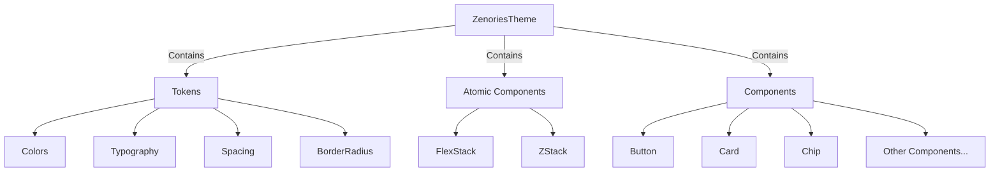

# Design System Architecture

This document describes how to construct a modular, scalable design system using `theme_tailor`, providing type-safe theming and component consistency across your Flutter application.

## Core Concepts

### Design System Structure

The design system follows a three-tier architecture:



**Three tiers**:
1. **Tokens**: Foundational design values (colors, typography, spacing, border radius)
2. **Atomic Components**: Low-level layout primitives used to build components
3. **Components**: Reusable UI elements (buttons, cards, chips, etc.)

### Why theme_tailor?

[theme_tailor](https://pub.dev/packages/theme_tailor) is a code generation tool that provides:

- **Type-safe theming**: Access theme values with compile-time safety
- **Automatic lerping**: Smooth theme transitions between light/dark modes
- **BuildContext extensions**: Convenient theme access via `context.zenoriesTheme`
- **Component modularity**: Each component defines its own theme extension

## Setting Up the Design System

### Step 1: Define the Token Layer

Tokens are the foundation of your design system. Create separate files for each token category.

#### Colors

Define a comprehensive color palette based on Material 3:

```dart
// lib/src/ui/colors.dart
import 'package:flutter/material.dart' show ColorScheme;

class ZenoriesColors {
  const ZenoriesColors({
    required this.primary,
    required this.onPrimary,
    required this.primaryContainer,
    required this.onPrimaryContainer,
    // ... all Material 3 color roles
    required this.surface,
    required this.onSurface,
    required this.error,
    required this.onError,
  });

  factory ZenoriesColors.fromMaterial(ColorScheme colorScheme) => 
      ZenoriesColors(
        primary: colorScheme.primary,
        onPrimary: colorScheme.onPrimary,
        // ... map all colors
      );

  // Primary colors
  final Color primary;
  final Color onPrimary;
  final Color primaryContainer;
  final Color onPrimaryContainer;
  
  // Surface colors
  final Color surface;
  final Color onSurface;
  final Color surfaceContainer;
  
  // Error colors
  final Color error;
  final Color onError;
  
  // ... all other Material 3 roles
}
```

**Create a custom encoder for theme_tailor**:

```dart
class ZenoriesColorsEncoder extends ThemeEncoder<ZenoriesColors> {
  const ZenoriesColorsEncoder();

  @override
  ZenoriesColors lerp(ZenoriesColors a, ZenoriesColors b, double t) {
    return ZenoriesColors(
      primary: Color.lerp(a.primary, b.primary, t)!,
      onPrimary: Color.lerp(a.onPrimary, b.onPrimary, t)!,
      // ... lerp all colors
    );
  }
}
```

#### Typography

Create a typography system with semantic naming:

```dart
// lib/src/ui/typography.dart
class ZenoriesTypography {
  const ZenoriesTypography({
    required this.displayLarge,
    required this.displayMedium,
    required this.displaySmall,
    required this.headlineLarge,
    required this.bodyMedium,
    required this.labelSmall,
    // ... all text styles
  });

  factory ZenoriesTypography.standard() => ZenoriesTypography(
    displayLarge: TextStyle(
      fontFamily: 'YourFont',
      fontSize: 57,
      height: 1.12,
      fontWeight: FontWeight.w400,
    ),
    bodyMedium: TextStyle(
      fontFamily: 'YourFont',
      fontSize: 14,
      height: 1.43,
      fontWeight: FontWeight.w400,
    ),
    // ... define all styles
  );

  final TextStyle displayLarge;
  final TextStyle bodyMedium;
  final TextStyle labelSmall;
  // ... all styles
}
```

**Typography encoder**:

```dart
class ZenoriesTypographyEncoder extends ThemeEncoder<ZenoriesTypography> {
  const ZenoriesTypographyEncoder();

  @override
  ZenoriesTypography lerp(ZenoriesTypography a, ZenoriesTypography b, double t) {
    return ZenoriesTypography(
      displayLarge: TextStyle.lerp(a.displayLarge, b.displayLarge, t)!,
      bodyMedium: TextStyle.lerp(a.bodyMedium, b.bodyMedium, t)!,
      // ... lerp all styles
    );
  }
}
```

#### Spacing

Define a consistent spacing scale:

```dart
// lib/src/ui/spacing.dart
class ZenoriesSpacing {
  const ZenoriesSpacing({
    required this.none,
    required this.xs,
    required this.sm,
    required this.md,
    required this.lg,
    required this.xl,
  });

  static const ZenoriesSpacing standard = ZenoriesSpacing(
    none: 0,
    xs: 4,
    sm: 8,
    md: 12,
    lg: 16,
    xl: 24,
  );

  final double none;
  final double xs;
  final double sm;
  final double md;
  final double lg;
  final double xl;
}
```

#### Border Radius

Define corner rounding values:

```dart
// lib/src/ui/border_radius.dart
class ZenoriesBorderRadius {
  const ZenoriesBorderRadius({
    required this.none,
    required this.sm,
    required this.md,
    required this.lg,
    required this.xl,
    required this.full,
  });

  static const standard = ZenoriesBorderRadius(
    none: 0,
    sm: 4,
    md: 8,
    lg: 12,
    xl: 16,
    full: 9999,
  );

  final double none;
  final double sm;
  final double md;
  final double lg;
  final double xl;
  final double full;

  // Convenience getters
  BorderRadius get mdRadius => BorderRadius.circular(md);
  BorderRadius get lgRadius => BorderRadius.circular(lg);
}
```

### Step 2: Create the Token Container

Combine all tokens into a single token class:

```dart
// lib/src/ui/theme.dart
import 'package:theme_tailor_annotation/theme_tailor_annotation.dart';

part 'theme.tailor.dart';

@tailorMixinComponent
@ZenoriesColorsEncoder()
@ZenoriesTypographyEncoder()
@ZenoriesSpacingEncoder()
@ZenoriesBorderRadiusEncoder()
class ZenoriesToken extends ThemeExtension<ZenoriesToken>
    with _$ZenoriesTokenTailorMixin {
  const ZenoriesToken({
    required this.colors,
    required this.typography,
    this.spacing = .standard,
    this.borderRadius = .standard,
    required this.brightness,
  });

  final Brightness brightness;
  final ZenoriesColors colors;
  final ZenoriesTypography typography;
  final ZenoriesSpacing spacing;
  final ZenoriesBorderRadius borderRadius;
}
```

**Key points**:
- Use `@tailorMixinComponent` to mark this as a theme component
- Use custom encoders with `@ZenoriesColorsEncoder()` annotations
- Provide default values for spacing and border radius with `.standard`

### Step 3: Define Component Themes

Each component should have its own theme class defining its styling properties.

#### Example: Button Theme

```dart
// lib/src/ui/button.dart
import 'package:theme_tailor_annotation/theme_tailor_annotation.dart';

part 'button.tailor.dart';

@tailorMixinComponent
class ZButtonTheme extends ThemeExtension<ZButtonTheme>
    with _$ZButtonThemeTailorMixin {
  ZButtonTheme({
    required this.shape,
    required this.surface,
    required this.onSurface,
    required this.textStyle,
    required this.constraints,
    required this.padding,
  });

  factory ZButtonTheme.standard(ZenoriesToken token) {
    final ZenoriesToken(:colors, :typography, :borderRadius, :spacing) = token;

    return ZButtonTheme(
      shape: RoundedRectangleBorder(
        borderRadius: BorderRadius.circular(borderRadius.xl),
      ),
      surface: WidgetStateColor.fromMap({
        WidgetState.disabled: colors.onSurface.withOpacity(0.12),
        WidgetState.pressed: colors.primary.withOpacity(0.6),
        WidgetState.any: colors.primary,
      }),
      onSurface: WidgetStateColor.fromMap({
        WidgetState.disabled: colors.onSurface.withOpacity(0.38),
        WidgetState.any: colors.onPrimary,
      }),
      textStyle: typography.bodyMedium,
      constraints: BoxConstraints(minHeight: 44, minWidth: 44),
      padding: EdgeInsets.all(spacing.sm),
    );
  }

  final ShapeBorder shape;
  final WidgetStateProperty<Color> surface;
  final WidgetStateProperty<Color> onSurface;
  final TextStyle textStyle;
  final Box Constraints constraints;
  final EdgeInsetsGeometry padding;
}
```

**Pattern**:
- Define a `ThemeExtension` for the component
- Create a `.standard(ZenoriesToken)` factory that builds default styling from tokens
- Use `WidgetStateProperty` for interactive states (hover, pressed, disabled)

### Step 4: Create the Master Theme

Combine tokens and component themes:

```dart
// lib/src/ui/theme.dart
@TailorMixin(themeGetter: ThemeGetter.onBuildContextProps)
class ZenoriesTheme extends ThemeExtension<ZenoriesTheme>
    with _$ZenoriesThemeTailorMixin {
  const ZenoriesTheme({
    required this.token,
    required this.button,
    required this.card,
    required this.chip,
    // ... all component themes
  });

  final ZenoriesToken token;
  final ZButtonTheme button;
  final ZCardTheme card;
  final ZChipTheme chip;
  // ... all component themes
}
```

**Key points**:
- Use `@TailorMixin(themeGetter: ThemeGetter.onBuildContextProps)` to generate `context.zenoriesTheme` extension
- Include token and all component themes

### Step 5: Create Theme Presets

Define light and dark theme instances:

```dart
// lib/src/ui/presets.dart
import 'package:flex_color_scheme/flex_color_scheme.dart';

ZenoriesTheme createTheme(ZenoriesToken token) {
  return ZenoriesTheme(
    token: token,
    button: ZButtonTheme.standard(token),
    card: ZCardTheme.standard(token),
    chip: ZChipTheme.standard(token),
    // ... all components
  );
}

final lightTheme = () {
  final flexColorTheme = FlexThemeData.light(scheme: FlexScheme.amber);
  final token = ZenoriesToken(
    colors: ZenoriesColors.fromMaterial(flexColorTheme.colorScheme),
    typography: ZenoriesTypography.standard(),
    brightness: Brightness.light,
  );

  return createTheme(token);
}();

final darkTheme = () {
  final flexColorTheme = FlexThemeData.dark(scheme: FlexScheme.aquaBlue);
  final token = ZenoriesToken(
    colors: ZenoriesColors.fromMaterial(flexColorTheme.colorScheme),
    typography: ZenoriesTypography.standard(),
    brightness: Brightness.dark,
  );

  return createTheme(token);
}();
```

### Step 6: Create Theme Provider

Wrap your app with a theme provider:

```dart
// lib/src/ui/theme.dart
class ZenoriesThemeProvider extends StatefulWidget {
  const ZenoriesThemeProvider({super.key, this.data, required this.child});

  final ZenoriesTheme? data;
  final Widget child;

  @override
  State<ZenoriesThemeProvider> createState() => _ZenoriesThemeProviderState();
}

class _ZenoriesThemeProviderState extends State<ZenoriesThemeProvider> {
  @override
  Widget build(BuildContext context) {
    final data = widget.data ?? 
        switch (MediaQuery.platformBrightnessOf(context)) {
          Brightness.light => lightTheme,
          Brightness.dark => darkTheme,
        };

    return Theme(
      data: ThemeData(extensions: [data]),
      child: widget.child,
    );
  }
}
```

### Step 7: Run Code Generation

Run build_runner to generate theme_tailor code:

```bash
dart run build_runner build --delete-conflicting-outputs
```

This generates:
- `theme.tailor.dart` - Theme extensions and BuildContext getters
- `button.tailor.dart` - Button theme extensions
- ... for each component

## Using the Design System

### Accessing Theme in Widgets

Use the generated extension methods:

```dart
class MyWidget extends StatelessWidget {
  @override
  Widget build(BuildContext context) {
    final theme = context.zenoriesTheme;
    final token = context.token;
    final button = context.button;

    return Container(
      color: token.colors.surface,
      padding: EdgeInsets.all(token.spacing.md),
      child: Text(
        'Hello',
        style: token.typography.bodyMedium,
      ),
    );
  }
}
```

### Creating Components

Build components using their theme:

```dart
class ZButton extends StatefulWidget {
  const ZButton({
    super.key,
    required this.child,
    this.onPressed,
    this.modifier,
  });

  final Widget child;
  final VoidCallback? onPressed;
  final ThemeModifier<ZButtonTheme>? modifier;

  @override
  State<ZButton> createState() => _ZButtonState();
}

class _ZButtonState extends State<ZButton> {
  @override
  Widget build(BuildContext context) {
    final theme = context.zenoriesTheme;
    final style = widget.modifier?.call(theme, theme.button) ?? theme.button;

    return GestureDetector(
      onTap: widget.onPressed,
      child: DecoratedBox(
        decoration: ShapeDecoration(
          shape: style.shape,
          color: style.surface.resolve(states),
        ),
        child: DefaultTextStyle.merge(
          style: style.textStyle.copyWith(
            color: style.onSurface.resolve(states),
          ),
          child: Padding(
            padding: style.padding,
            child: widget.child,
          ),
        ),
      ),
    );
  }
}
```

### Theme Modification Pattern

Allow components to be customized with theme modifiers:

```dart
// Define modifiers as static methods
class ZButton extends StatefulWidget {
  static ThemeModifier<ZButtonTheme> get accentModifier =>
      (theme, style) => style.copyWith(
        surface: WidgetStateColor.fromMap({
          WidgetState.any: theme.token.colors.surfaceContainer,
        }),
        onSurface: WidgetStateColor.fromMap({
          WidgetState.any: theme.token.colors.onSurfaceVariant,
        }),
      );

  static ThemeModifier<ZButtonTheme> get outlinedModifier =>
      (theme, style) => style.copyWith(
        surface: WidgetStateColor.fromMap({
          WidgetState.any: theme.token.colors.surface,
        }),
        shape: RoundedRectangleBorder(
          borderRadius: BorderRadius.circular(theme.token.borderRadius.xl),
          side: BorderSide(color: theme.token.colors.outline),
        ),
      );
}

// Usage
ZButton(
  modifier: ZButton.accentModifier,
  onPressed: () {},
  child: Text('Accent Button'),
)
```

## Advanced Patterns

### Variable Fonts

Use variable fonts for fine-grained control:

```dart
factory ZenoriesTypography.standard() => ZenoriesTypography(
  displayLarge: TextStyle(
    fontFamily: 'GoogleSansFlex',
    fontSize: 57,
    fontVariations: [
      FontVariation('wght', 350),
      FontVariation('opsz', 144),
      FontVariation('ROND', 50), // roundness
    ],
  ),
);
```

### Dynamic Color Support

Integrate with Material You dynamic colors:

```dart
// lib/src/ui/dynamic_color.dart
extension DynamicColorExtension on Widget {
  Widget withDynamicColor() {
    return DynamicColorBuilder(
      builder: (lightDynamic, darkDynamic) {
        // Use system colors if available
        if (lightDynamic != null && darkDynamic != null) {
          return this; // Apply dynamic colors
        }
        return this; // Fallback to static colors
      },
    );
  }
}
```

### Custom Component Pattern

Follow this pattern for all components:

1. **Create theme class** with `@tailorMixinComponent`
2. **Define `.standard(ZenoriesToken)` factory** for default styling
3. **Create component widget** that uses its theme
4. **Support modifiers** for customization
5. **Export from `ui.dart`**

## File Organization

```
lib/src/ui/
├── design_system.dart       # Token exports
├── ui.dart                  # Public API
├── theme.dart               # Master theme
├── presets.dart             # Theme instances
│
├── colors.dart              # Color tokens
├── typography.dart          # Typography tokens
├── spacing.dart             # Spacing tokens
├── border_radius.dart       # Border radius tokens
│
├── button.dart              # Button component
├── button.tailor.dart       # Generated
├── card.dart                # Card component
├── card.tailor.dart         # Generated
└── ...                      # Other components
```

## Best Practices

### 1. Token-First Design

Always reference tokens, never hardcode values:

✅ **Good**:
```dart
color: token.colors.primary,
padding: EdgeInsets.all(token.spacing.md),
borderRadius: BorderRadius.circular(token.borderRadius.lg),
```

❌ **Bad**:
```dart
color: Colors.blue,
padding: EdgeInsets.all(12),
borderRadius: BorderRadius.circular(12),
```

### 2. Semantic Color Names

Use Material 3 semantic color roles:

```dart
// Primary actions
surface: colors.primary,
onSurface: colors.onPrimary,

// Secondary actions
surface: colors.secondary Container,
onSurface: colors.onSecondaryContainer,

// Surfaces
background: colors.surface,
text: colors.onSurface,
```

### 3. Component Independence

Each component theme should be self-contained:

```dart
// Button doesn't know about Card
factory ZButtonTheme.standard(ZenoriesToken token) {
  // Only uses token, not other component themes
  return ZButtonTheme(...);
}
```

### 4. Consistent Naming

Follow naming conventions:

- Theme classes: `Z{Component}Theme`
- Components: `Z{Component}`
- Modifiers: `{variant}Modifier` (static methods)
- Tokens: `Zenories{Token}` (e.g., `ZenoriesColors`)

### 5. State Management

Use `WidgetStateProperty` for interactive states:

```dart
surface: WidgetStateColor.fromMap({
  WidgetState.disabled: colors.onSurface.withOpacity(0.12),
  WidgetState.hovered: colors.primary.withOpacity(0.8),
  WidgetState.pressed: colors.primary.withOpacity(0.6),
  WidgetState.focused: colors.primary.withOpacity(0.9),
  WidgetState.any: colors.primary,
}),
```

## Summary

The design system provides:

- ✅ **Type-safe**: Compile-time theme access via generated extensions
- ✅ **Modular**: Each component has its own theme
- ✅ **Scalable**: Easy to add new tokens and components
- ✅ **Consistent**: Single source of truth for design values
- ✅ **Flexible**: Theme modifiers for component customization
- ✅ **Maintainable**: Clear separation of tokens, themes, and components
