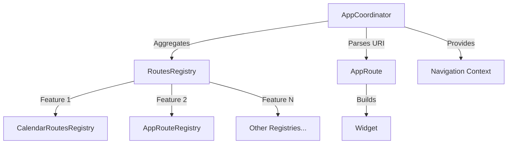

# Router Architecture

The Zenories app uses a modular, feature-based routing architecture built on top of [zenrouter](https://pub.dev/packages/zenrouter). This architecture enables clean separation of concerns, allowing each feature module to define its own routes while maintaining a centralized coordination layer.

## Core Concepts

### 1. Architecture Overview

The routing system consists of three main layers:



- **AppCoordinator**: Central coordinator that manages all feature registries and handles route resolution
- **RoutesRegistry**: Abstract interface that each feature implements to register its routes
- **AppRoute**: Individual route definitions that map URIs to widgets

### 2. Key Components

#### AppRoute

`AppRoute` is the base class for all routes in the application. It extends `RouteTarget` and mixes in `RouteUnique` from zenrouter.

```dart
abstract class AppRoute extends RouteTarget with RouteUnique {
  @override
  Widget build(covariant AppCoordinator coordinator, BuildContext context);
}
```

**Key responsibilities**:
- Define the `build` method to create the widget for this route
- Implement `toUri()` to convert the route to a URI (for deep linking)
- Optionally mix in `RouteTransition` for custom transitions
- Optionally mix in `RouteRedirect` for route redirects

#### RoutesRegistry

`RoutesRegistry` is an abstract class that each feature module implements to register its routes.

```dart
abstract class RoutesRegistry {
  /// Create navigation paths for this feature.
  List<StackPath> get paths => [];

  /// Try to recover a route from URI.
  /// Returns null if this registry doesn't handle the URI.
  FutureOr<AppRoute?> parseRouteFromUri(Uri uri);

  /// Define layout for this feature.
  void defineLayout() {}

  /// Define converter for this feature.
  void defineConverter() {}
}
```

**Key responsibilities**:
- Parse URIs and return the appropriate `AppRoute` (or null if not handled)
- Define navigation paths via the `paths` getter
- Optionally define layouts and converters for the feature

#### AppCoordinator

`AppCoordinator` is the central coordinator that aggregates all feature registries and manages route resolution.

```dart
abstract class AppCoordinator extends Coordinator<AppRoute> {
  Map<Type, RoutesRegistry> get featureRouteRegistries;

  @override
  List<StackPath> get paths => [
    ...super.paths,
    for (final registry in featureRouteRegistries.values) ...registry.paths,
  ];

  AppRoute notFoundRoute(Uri uri);

  T routeRegistry<T extends RoutesRegistry>() => featureRouteRegistries[T] as T;

  @override
  FutureOr<AppRoute> parseRouteFromUri(Uri uri) async {
    for (final registry in featureRouteRegistries.values) {
      final route = await registry.parseRouteFromUri(uri);
      if (route != null) return route;
    }
    return notFoundRoute(uri);
  }
}
```

**Key responsibilities**:
- Aggregate all feature registries
- Delegate URI parsing to the appropriate registry
- Provide a fallback `notFoundRoute` when no registry handles the URI
- Expose a `routeRegistry<T>()` method to access specific registries
- Wrap the layout with `AppCoordinatorProvider` for context access

## Implementation Guide

### Step 1: Define Routes in a Feature

Each feature module should define its routes and implement a `RoutesRegistry`.

**Example**: Feature routes

```dart
class FeatureDetailRoute extends AppRoute with RouteTransition, SheetRouteMixin {
  FeatureDetailRoute({this.itemId});

  final String? itemId;

  @override
  Widget build(covariant AppCoordinator coordinator, BuildContext context) =>
      FeatureDetailView(itemId: itemId);

  @override
  Uri toUri() => Uri.parse('/feature/detail')
      .replace(queryParameters: {'itemId': itemId});
}
```

### Step 2: Create a RoutesRegistry for the Feature

```dart
class FeatureRoutesRegistry extends RoutesRegistry {
  @override
  FutureOr<AppRoute?> parseRouteFromUri(Uri uri) => switch (uri.pathSegments) {
    ['feature', 'detail'] => FeatureDetailRoute(
      itemId: uri.queryParameters['itemId'],
    ),
    _ => null,
  };
}
```

**Key points**:
- Use pattern matching to parse URI path segments
- Extract query parameters as needed
- Return `null` if the URI is not handled by this registry

### Step 3: Register the Feature in AppCoordinator

In your app's coordinator implementation, register all feature registries.

```dart
class AppCoordinatorImpl extends AppCoordinator {
  @override
  final Map<Type, RoutesRegistry> featureRouteRegistries = {
    AppRouteRegistry: AppRouteRegistry(),
    FeatureRoutesRegistry: FeatureRoutesRegistry(),
  };

  @override
  AppRoute notFoundRoute(Uri uri) => NotFoundRoute(uri);
}
```

### Step 4: Provide the Coordinator in DI

Override the `coordinatorProvider` in your app's dependency injection setup.

```dart
// lib/di/instance.dart
Future<ProviderContainer> createProviderContainer() async {
  final overrides = <Override>[];
  
  overrides.add(
    coordinatorProvider.overrideWithValue(AppCoordinatorImpl()),
  );

  return ProviderContainer(overrides: overrides);
}
```

## Route Transitions

The routing system supports custom transitions through the `RouteTransition` mixin.

### SheetRouteMixin

A built-in transition mixin for sheet-style presentations using the `stupid_simple_sheet` package.

```dart
mixin SheetRouteMixin on RouteTransition {
  bool get dissmissable => true;

  @override
  StackTransition<T> transition<T extends RouteUnique>(
    covariant Coordinator<RouteUnique> coordinator,
  ) => .custom(
    builder: (context) => Builder(
      builder: (context) => build(coordinator, context),
    ),
    pageBuilder: (context, routeKey, child) => SmoothSheetPage(
      key: routeKey,
      dissmissable: dissmissable,
      child: child,
    ),
  );
}
```

**Usage**:
```dart
class MySheetRoute extends AppRoute with RouteTransition, SheetRouteMixin {
  @override
  bool get dissmissable => false; // Override to make non-dismissable
  
  // ... rest of implementation
}
```

## Accessing the Coordinator

### In Widgets (via BuildContext)

Use the `coordinator` extension on `BuildContext`:

```dart
class MyWidget extends StatelessWidget {
  @override
  Widget build(BuildContext context) {
    final coordinator = context.coordinator;
    
    // Navigate to a route
    coordinator.push(HomeRoute());
    
    return Container();
  }
}
```


### In Riverpod Providers (via Ref)

Use the `coordinator` extension on `Ref`:

```dart
final myProvider = Provider((ref) {
  final coordinator = ref.coordinator;
  
  // Access coordinator
  return SomeService(coordinator);
});
```


## Route Patterns

### Basic Route

A simple route that displays a widget:

```dart
class HomeRoute extends AppRoute {
  @override
  Uri toUri() => Uri.parse('/home');

  @override
  Widget build(AppCoordinator coordinator, BuildContext context) => HomeView();
}
```

### Route with Parameters

A route that accepts parameters from the URI:

```dart
class ItemDetailRoute extends AppRoute with RouteTransition, SheetRouteMixin {
  ItemDetailRoute({this.itemId});

  final String? itemId;

  @override
  Widget build(covariant AppCoordinator coordinator, BuildContext context) =>
      ItemDetailView(itemId: itemId);

  @override
  Uri toUri() => Uri.parse('/items/detail')
      .replace(queryParameters: {'itemId': itemId});
}
```

### Redirect Route

A route that redirects to another route:

```dart
class IndexRoute extends AppRoute with RouteRedirect<AppRoute> {
  @override
  Uri toUri() => Uri.parse('/');

  @override
  Widget build(AppCoordinator coordinator, BuildContext context) => SizedBox();

  @override
  AppRoute redirect() => HomeRoute();
}
```

## Feature Module Structure

Each feature module should organize its router code as follows:

```
packages/your_feature/
├── lib/
│   └── src/
│       └── router/
│           ├── router.dart          # Exports all router components
│           ├── registry.dart        # RoutesRegistry implementation
│           └── routes/              # Individual route definitions
│               ├── route_one.dart
│               └── route_two.dart
```

**Example export file**:

```dart
library;

export 'routes/feature_detail.dart';
export 'registry.dart';
```

## Navigation Examples

### Push a Route

```dart
// In a widget
context.coordinator.push(FeatureDetailRoute());

// In a provider
ref.coordinator.push(FeatureDetailRoute());
```

### Navigate by URI

```dart
final uri = Uri.parse('/feature/detail?itemId=123');
final route = await context.coordinator.parseRouteFromUri(uri);
context.coordinator.push(route);
```

### Pop the Current Route

```dart
context.coordinator.pop();
```

### Access a Specific Registry

```dart
final featureRegistry = context.coordinator.routeRegistry<FeatureRoutesRegistry>();
```

## Best Practices

### 1. Keep Routes Stateless

Routes should be simple data classes that describe navigation intent. Avoid putting business logic in routes.

✅ **Good**:
```dart
class UserProfileRoute extends AppRoute {
  UserProfileRoute({required this.userId});
  final String userId;
  
  @override
  Widget build(AppCoordinator coordinator, BuildContext context) =>
      UserProfileView(userId: userId);
}
```

❌ **Bad**:
```dart
class UserProfileRoute extends AppRoute {
  // Don't fetch data in routes
  Future<User> fetchUser() async { ... }
}
```

### 2. Use Pattern Matching for URI Parsing

Leverage Dart's pattern matching for clean, readable URI parsing:

```dart
@override
FutureOr<AppRoute?> parseRouteFromUri(Uri uri) => switch (uri.pathSegments) {
  ['users'] => UsersListRoute(),
  ['users', String userId] => UserProfileRoute(userId: userId),
  ['users', String userId, 'settings'] => UserSettingsRoute(userId: userId),
  _ => null,
};
```

### 3. Handle Query Parameters Gracefully

Always handle optional query parameters with null safety:

```dart
@override
FutureOr<AppRoute?> parseRouteFromUri(Uri uri) => switch (uri.pathSegments) {
  ['search'] => SearchRoute(
    query: uri.queryParameters['q'],
    filter: uri.queryParameters['filter'],
  ),
  _ => null,
};
```

### 4. Implement toUri() Correctly

Ensure `toUri()` generates valid URIs that can be parsed back by `parseRouteFromUri()`:

```dart
class SearchRoute extends AppRoute {
  SearchRoute({this.query, this.filter});
  
  final String? query;
  final String? filter;
  
  @override
  Uri toUri() => Uri.parse('/search').replace(
    queryParameters: {
      if (query != null) 'q': query,
      if (filter != null) 'filter': filter,
    },
  );
}
```

### 5. Organize Routes by Feature

Keep route definitions close to the feature they belong to, not in a central routes file.

```
✅ Good structure:
packages/
├── feature_a/
│   └── lib/src/router/
│       ├── registry.dart
│       └── routes/
│           └── feature_a_detail.dart
└── feature_b/
    └── lib/src/router/
        ├── registry.dart
        └── routes/
            ├── feature_b_list.dart
            └── feature_b_detail.dart

❌ Bad structure:
apps/your_app/
└── lib/
    └── routes/
        ├── feature_a_routes.dart
        ├── feature_b_routes.dart
        └── ... (all routes in one place)
```

## Advanced Topics

### Custom Transitions

Create custom transitions by implementing the `RouteTransition` mixin:

```dart
mixin FadeRouteMixin on RouteTransition {
  @override
  StackTransition<T> transition<T extends RouteUnique>(
    covariant Coordinator<RouteUnique> coordinator,
  ) => .custom(
    builder: (context) => build(coordinator, context),
    pageBuilder: (context, routeKey, child) => PageRouteBuilder(
      settings: RouteSettings(name: routeKey.toString()),
      pageBuilder: (context, animation, secondaryAnimation) => child,
      transitionsBuilder: (context, animation, secondaryAnimation, child) {
        return FadeTransition(opacity: animation, child: child);
      },
    ),
  );
}
```

### Nested Navigation

WIP

## Related Documentation

- **Dependency Injection (DI) Pattern** - Learn how to set up the coordinator in DI
- **Event Bus** - Coordinate navigation with events
- [zenrouter package](https://pub.dev/packages/zenrouter) - Official zenrouter documentation

## Summary

The Zenories routing architecture provides:

- ✅ **Modular**: Each feature defines its own routes independently
- ✅ **Type-safe**: Compile-time checking of route parameters
- ✅ **Testable**: Easy to mock and test route navigation
- ✅ **Deep linking**: Built-in URI parsing and generation
- ✅ **Flexible**: Support for custom transitions and redirects
- ✅ **Scalable**: Easy to add new features without modifying core code
