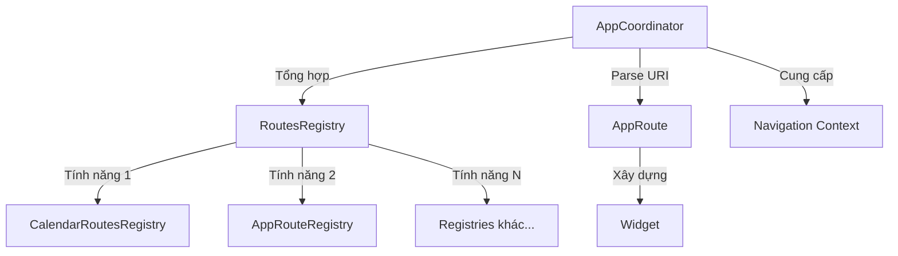

# Kiến trúc Router

Ứng dụng sử dụng kiến trúc routing modular, dựa trên tính năng (feature-based) được xây dựng trên [zenrouter](https://pub.dev/packages/zenrouter). Kiến trúc này cho phép tách biệt rõ ràng các mối quan tâm (separation of concerns), cho phép mỗi module tính năng định nghĩa các route riêng trong khi duy trì một lớp điều phối tập trung.

## Các khái niệm cốt lõi

### 1. Tổng quan kiến trúc

Hệ thống routing bao gồm ba lớp chính:



- **AppCoordinator**: Coordinator trung tâm quản lý tất cả các registry tính năng và xử lý việc phân giải route
- **RoutesRegistry**: Interface trừu tượng mà mỗi tính năng triển khai để đăng ký các route của nó
- **AppRoute**: Định nghĩa route riêng lẻ ánh xạ URI tới widget

### 2. Các thành phần chính

#### AppRoute

`AppRoute` là class cơ sở cho tất cả các route trong ứng dụng. Nó kế thừa `RouteTarget` và mixin `RouteUnique` từ zenrouter.

```dart
abstract class AppRoute extends RouteTarget with RouteUnique {
  @override
  Widget build(covariant AppCoordinator coordinator, BuildContext context);
}
```

**Trách nhiệm chính**:
- Định nghĩa phương thức `build` để tạo widget cho route này
- Triển khai `toUri()` để chuyển đổi route thành URI (cho deep linking)
- Tùy chọn mixin `RouteTransition` cho các transition tùy chỉnh
- Tùy chọn mixin `RouteRedirect` cho việc chuyển hướng route

#### RoutesRegistry

`RoutesRegistry` là một abstract class mà mỗi module tính năng triển khai để đăng ký các route của nó.

```dart
abstract class RoutesRegistry {
  /// Tạo navigation paths cho tính năng này.
  List<StackPath> get paths => [];

  /// Thử khôi phục một route từ URI.
  /// Trả về null nếu registry này không xử lý URI.
  FutureOr<AppRoute?> parseRouteFromUri(Uri uri);

  /// Định nghĩa layout cho tính năng này.
  void defineLayout() {}

  /// Định nghĩa converter cho tính năng này.
  void defineConverter() {}
}
```

**Trách nhiệm chính**:
- Parse URI và trả về `AppRoute` phù hợp (hoặc null nếu không xử lý)
- Định nghĩa navigation paths thông qua getter `paths`
- Tùy chọn định nghĩa layout và converter cho tính năng

#### AppCoordinator

`AppCoordinator` là coordinator trung tâm tổng hợp tất cả các registry tính năng và quản lý việc phân giải route.

```dart
abstract class AppCoordinator extends Coordinator<AppRoute> {
  Map<Type, RoutesRegistry> get featureRouteRegistries;

  @override
  List<StackPath> get paths => [
    ...super.paths,
    for (final registry in featureRouteRegistries.values) ...registry.paths,
  ];

  AppRoute notFoundRoute(Uri uri);

  T routeRegistry<T extends RoutesRegistry>() => featureRouteRegistries[T] as T;

  @override
  FutureOr<AppRoute> parseRouteFromUri(Uri uri) async {
    for (final registry in featureRouteRegistries.values) {
      final route = await registry.parseRouteFromUri(uri);
      if (route != null) return route;
    }
    return notFoundRoute(uri);
  }
}
```

**Trách nhiệm chính**:
- Tổng hợp tất cả các registry tính năng
- Ủy quyền việc parse URI cho registry phù hợp
- Cung cấp `notFoundRoute` dự phòng khi không có registry nào xử lý URI
- Expose phương thức `routeRegistry<T>()` để truy cập các registry cụ thể
- Bao bọc layout với `AppCoordinatorProvider` để truy cập context

## Hướng dẫn triển khai

### Bước 1: Định nghĩa Routes trong một tính năng

Mỗi module tính năng nên định nghĩa các route của nó và triển khai một `RoutesRegistry`.

**Ví dụ**: Route tính năng

```dart
class FeatureDetailRoute extends AppRoute with RouteTransition, SheetRouteMixin {
  FeatureDetailRoute({this.itemId});

  final String? itemId;

  @override
  Widget build(covariant AppCoordinator coordinator, BuildContext context) =>
      FeatureDetailView(itemId: itemId);

  @override
  Uri toUri() => Uri.parse('/feature/detail')
      .replace(queryParameters: {'itemId': itemId});
}
```

### Bước 2: Tạo RoutesRegistry cho tính năng

```dart
class FeatureRoutesRegistry extends RoutesRegistry {
  @override
  FutureOr<AppRoute?> parseRouteFromUri(Uri uri) => switch (uri.pathSegments) {
    ['feature', 'detail'] => FeatureDetailRoute(
      itemId: uri.queryParameters['itemId'],
    ),
    _ => null,
  };
}
```

**Điểm chính**:
- Sử dụng pattern matching để parse các path segment của URI
- Trích xuất query parameters khi cần
- Trả về `null` nếu URI không được xử lý bởi registry này

### Bước 3: Đăng ký tính năng trong AppCoordinator

Trong triển khai coordinator của ứng dụng, đăng ký tất cả các registry tính năng.

```dart
class AppCoordinatorImpl extends AppCoordinator {
  @override
  final Map<Type, RoutesRegistry> featureRouteRegistries = {
    AppRouteRegistry: AppRouteRegistry(),
    FeatureRoutesRegistry: FeatureRoutesRegistry(),
  };

  @override
  AppRoute notFoundRoute(Uri uri) => NotFoundRoute(uri);
}
```

### Bước 4: Cung cấp Coordinator trong DI

Override `coordinatorProvider` trong thiết lập dependency injection của ứng dụng.

```dart
// lib/di/instance.dart
Future<ProviderContainer> createProviderContainer() async {
  final overrides = <Override>[];
  
  overrides.add(
    coordinatorProvider.overrideWithValue(AppCoordinatorImpl()),
  );

  return ProviderContainer(overrides: overrides);
}
```

## Route Transitions

Hệ thống routing hỗ trợ các transition tùy chỉnh thông qua mixin `RouteTransition`.

### SheetRouteMixin

Một mixin transition tích hợp sẵn cho các bài trình bày kiểu sheet sử dụng package `stupid_simple_sheet`.

```dart
mixin SheetRouteMixin on RouteTransition {
  bool get dissmissable => true;

  @override
  StackTransition<T> transition<T extends RouteUnique>(
    covariant Coordinator<RouteUnique> coordinator,
  ) => .custom(
    builder: (context) => Builder(
      builder: (context) => build(coordinator, context),
    ),
    pageBuilder: (context, routeKey, child) => SmoothSheetPage(
      key: routeKey,
      dissmissable: dissmissable,
      child: child,
    ),
  );
}
```

**Sử dụng**:
```dart
class MySheetRoute extends AppRoute with RouteTransition, SheetRouteMixin {
  @override
  bool get dissmissable => false; // Override để làm cho không thể dismiss
  
  // ... phần còn lại của triển khai
}
```

## Truy cập Coordinator

### Trong Widgets (qua BuildContext)

Sử dụng extension `coordinator` trên `BuildContext`:

```dart
class MyWidget extends StatelessWidget {
  @override
  Widget build(BuildContext context) {
    final coordinator = context.coordinator;
    
    // Điều hướng đến một route
    coordinator.push(HomeRoute());
    
    return Container();
  }
}
```


### Trong Riverpod Providers (qua Ref)

Sử dụng extension `coordinator` trên `Ref`:

```dart
final myProvider = Provider((ref) {
  final coordinator = ref.coordinator;
  
  // Truy cập coordinator
  return SomeService(coordinator);
});
```


## Các mẫu Route

### Route cơ bản

Một route đơn giản hiển thị một widget:

```dart
class HomeRoute extends AppRoute {
  @override
  Uri toUri() => Uri.parse('/home');

  @override
  Widget build(AppCoordinator coordinator, BuildContext context) => HomeView();
}
```

### Route với tham số

Một route chấp nhận tham số từ URI:

```dart
class ItemDetailRoute extends AppRoute with RouteTransition, SheetRouteMixin {
  ItemDetailRoute({this.itemId});

  final String? itemId;

  @override
  Widget build(covariant AppCoordinator coordinator, BuildContext context) =>
      ItemDetailView(itemId: itemId);

  @override
  Uri toUri() => Uri.parse('/items/detail')
      .replace(queryParameters: {'itemId': itemId});
}
```

### Route chuyển hướng

Một route chuyển hướng đến route khác:

```dart
class IndexRoute extends AppRoute with RouteRedirect<AppRoute> {
  @override
  Uri toUri() => Uri.parse('/');

  @override
  Widget build(AppCoordinator coordinator, BuildContext context) => SizedBox();

  @override
  AppRoute redirect() => HomeRoute();
}
```

## Cấu trúc module tính năng

Mỗi module tính năng nên tổ chức code router như sau:

```
packages/your_feature/
├── lib/
│   └── src/
│       └── router/
│           ├── router.dart          # Export tất cả các thành phần router
│           ├── registry.dart        # Triển khai RoutesRegistry
│           └── routes/              # Định nghĩa các route riêng lẻ
│               ├── route_one.dart
│               └── route_two.dart
```

**Ví dụ file export**:

```dart
library;

export 'routes/feature_detail.dart';
export 'registry.dart';
```

## Ví dụ điều hướng

### Push một Route

```dart
// Trong một widget
context.coordinator.push(FeatureDetailRoute());

// Trong một provider
ref.coordinator.push(FeatureDetailRoute());
```

### Điều hướng bằng URI

```dart
final uri = Uri.parse('/feature/detail?itemId=123');
final route = await context.coordinator.parseRouteFromUri(uri);
context.coordinator.push(route);
```

### Pop Route hiện tại

```dart
context.coordinator.pop();
```

### Truy cập một Registry cụ thể

```dart
final featureRegistry = context.coordinator.routeRegistry<FeatureRoutesRegistry>();
```

## Các phương pháp tốt nhất

### 1. Giữ Routes không có trạng thái (Stateless)

Routes nên là các data class đơn giản mô tả ý định điều hướng. Tránh đặt business logic trong routes.

✅ **Tốt**:
```dart
class UserProfileRoute extends AppRoute {
  UserProfileRoute({required this.userId});
  final String userId;
  
  @override
  Widget build(AppCoordinator coordinator, BuildContext context) =>
      UserProfileView(userId: userId);
}
```

❌ **Không tốt**:
```dart
class UserProfileRoute extends AppRoute {
  // Không fetch dữ liệu trong routes
  Future<User> fetchUser() async { ... }
}
```

### 2. Sử dụng Pattern Matching cho URI Parsing

Tận dụng pattern matching của Dart cho việc parse URI rõ ràng, dễ đọc:

```dart
@override
FutureOr<AppRoute?> parseRouteFromUri(Uri uri) => switch (uri.pathSegments) {
  ['users'] => UsersListRoute(),
  ['users', String userId] => UserProfileRoute(userId: userId),
  ['users', String userId, 'settings'] => UserSettingsRoute(userId: userId),
  _ => null,
};
```

### 3. Xử lý Query Parameters một cách uyển chuyển

Luôn xử lý các query parameters tùy chọn với null safety:

```dart
@override
FutureOr<AppRoute?> parseRouteFromUri(Uri uri) => switch (uri.pathSegments) {
  ['search'] => SearchRoute(
    query: uri.queryParameters['q'],
    filter: uri.queryParameters['filter'],
  ),
  _ => null,
};
```

### 4. Triển khai toUri() đúng cách

Đảm bảo `toUri()` tạo ra các URI hợp lệ có thể được parse ngược lại bởi `parseRouteFromUri()`:

```dart
class SearchRoute extends AppRoute {
  SearchRoute({this.query, this.filter});
  
  final String? query;
  final String? filter;
  
  @override
  Uri toUri() => Uri.parse('/search').replace(
    queryParameters: {
      if (query != null) 'q': query,
      if (filter != null) 'filter': filter,
    },
  );
}
```

### 5. Tổ chức Routes theo tính năng

Giữ định nghĩa route gần với tính năng mà chúng thuộc về, không phải trong một file routes trung tâm.

```
✅ Cấu trúc tốt:
packages/
├── feature_a/
│   └── lib/src/router/
│       ├── registry.dart
│       └── routes/
│           └── feature_a_detail.dart
└── feature_b/
    └── lib/src/router/
        ├── registry.dart
        └── routes/
            ├── feature_b_list.dart
            └── feature_b_detail.dart

❌ Cấu trúc không tốt:
apps/your_app/
└── lib/
    └── routes/
        ├── feature_a_routes.dart
        ├── feature_b_routes.dart
        └── ... (tất cả routes ở một nơi)
```

## Chủ đề nâng cao

### Transition tùy chỉnh

Tạo các transition tùy chỉnh bằng cách triển khai mixin `RouteTransition`:

```dart
mixin FadeRouteMixin on RouteTransition {
  @override
  StackTransition<T> transition<T extends RouteUnique>(
    covariant Coordinator<RouteUnique> coordinator,
  ) => .custom(
    builder: (context) => build(coordinator, context),
    pageBuilder: (context, routeKey, child) => PageRouteBuilder(
      settings: RouteSettings(name: routeKey.toString()),
      pageBuilder: (context, animation, secondaryAnimation) => child,
      transitionsBuilder: (context, animation, secondaryAnimation, child) {
        return FadeTransition(opacity: animation, child: child);
      },
    ),
  );
}
```

### Điều hướng lồng nhau (Nested Navigation)

WIP

## Tài liệu liên quan

- **Dependency Injection (DI) Pattern** - Tìm hiểu cách thiết lập coordinator trong DI
- **Event Bus** - Điều phối điều hướng với events
- [zenrouter package](https://pub.dev/packages/zenrouter) - Tài liệu chính thức của zenrouter

## Tóm tắt

Kiến trúc routing cung cấp:

- ✅ **Modular**: Mỗi tính năng định nghĩa các route của riêng nó một cách độc lập
- ✅ **Type-safe**: Kiểm tra compile-time cho các tham số route
- ✅ **Testable**: Dễ dàng mock và test việc điều hướng route
- ✅ **Deep linking**: Parse và tạo URI tích hợp sẵn
- ✅ **Flexible**: Hỗ trợ các transition và redirect tùy chỉnh
- ✅ **Scalable**: Dễ dàng thêm các tính năng mới mà không cần sửa đổi code cốt lõi
