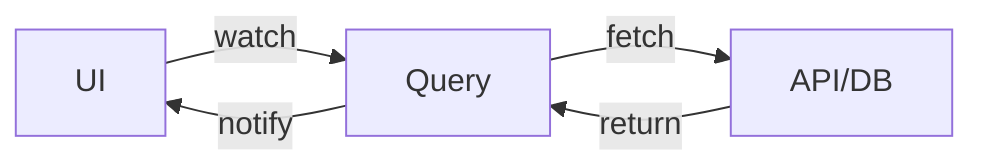
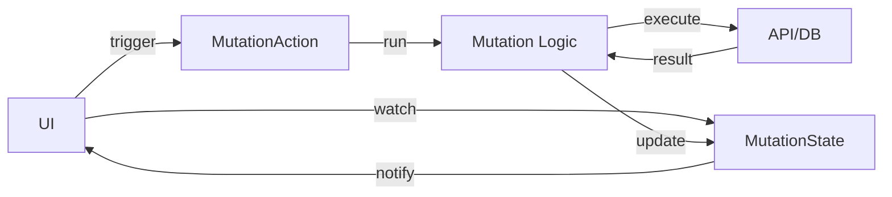
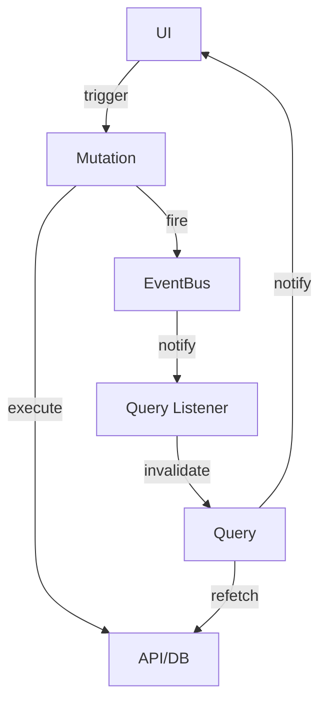
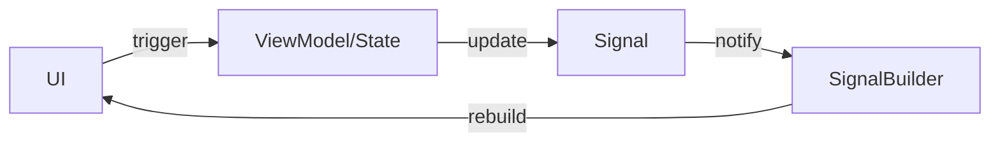

# Kiến Trúc QMS + EventBus

Kiến trúc QMS + EventBus (QMSE) là một kiến trúc phẳng, gọn nhẹ, thân thiện với AI cho các ứng dụng Flutter. Nó giúp team của bạn tổ chức codebase một cách bảo trì được và mở rộng tuyến tính mà không có sự đánh đổi về chi phí tinh thần.

Kiến trúc QMSE không coi cơ sở hạ tầng chung (network, local storage, v.v.) là "core" mà coi như các module. QMSE chỉ cung cấp một tập hợp các primitive để xây dựng ứng dụng, giúp nó rất linh hoạt và dễ học từ đầu.

## Triết Lý

### Vấn Đề với Các Kiến Trúc Truyền Thống

Hầu hết các kiến trúc hoạt động như một **khuôn mẫu** cho ứng dụng của bạn. Chúng quy định cấu trúc cứng nhắc nơi *mọi* tính năng **phải** được triển khai theo một cách cụ thể:

- **Clean Architecture**: Buộc bạn phải qua các lớp UseCase → Repository → DataSource ngay cả với các tính năng đơn giản
- **BLoC Pattern**: Yêu cầu boilerplate Event → BLoC → State cho mọi tương tác
- **MVVM/MVI**: Đòi hỏi các lớp ViewModel/Intent bất kể độ phức tạp

Điều này trông rất đẹp trong các bài blog và hội thảo. Nhưng trong thực tế, nó trở thành **cơn ác mộng** để bảo trì vì:

1. **Ứng dụng thực tế có nhu cầu riêng**: Một tính năng chat cần các pattern khác với luồng thanh toán
2. **Không phải tất cả tính năng đều bằng nhau**: Lấy hồ sơ người dùng không nên cần cùng một nghi thức với các workflow phức tạp
3. **Boilerplate bùng nổ**: Những thay đổi đơn giản yêu cầu chạm vào 5+ file qua nhiều lớp
4. **Chiến đấu với framework**: Bạn dành thời gian thỏa mãn kiến trúc thay vì giải quyết vấn đề

### Cách Tiếp Cận QMSE: Hướng Dẫn, Không Phải Khuôn Mẫu

Một kiến trúc tốt nên hoạt động như một **hướng dẫn**, không phải khuôn mẫu. Nó cung cấp **primitive** và **pattern** nhưng để bạn chọn cách áp dụng chúng.

**QMSE cung cấp cho bạn các khối xây dựng**:
- Sử dụng Query để fetch data
- Sử dụng Mutation để thực hiện hành động
- Sử dụng Store cho dependencies
- Sử dụng EventBus để tách rời các component

**Nhưng không bắt buộc cách thức**: Một màn hình đơn giản có thể chỉ sử dụng Queries. Một workflow phức tạp có thể sử dụng cả bốn. Một trang cài đặt có thể bỏ qua EventBus hoàn toàn. **Kiến trúc thích nghi với tính năng của bạn, không phải ngược lại.**

### Tính Linh Hoạt Thực Tế

Đây là cách QMSE duy trì tính linh hoạt:

**Tính Năng Đơn Giản** (User Profile):
```dart
// Chỉ một query - không cần Repository!
final userProfileQuery = createQuery<UserProfile>((ref) async {
  final response = await dio.get('/api/users/me');
  return UserProfile.fromJson(response.data);
});

// Sử dụng trong UI
class ProfileView extends ConsumerWidget {
  Widget build(context, ref) {
    final profile = ref.watch(userProfileQuery);
    return profile.when(...);
  }
}
```

**Tính Năng Phức Tạp** (Calendar với đồng bộ):
```dart
// Sử dụng tất cả primitives cho nhu cầu phức tạp
final calendarQuery = createQuery<List<Event>>((ref) async {
  final sub = ref.read(calendarEventBus).on<EventUpdated>()
    .listen((_) => ref.invalidateSelf());
  ref.onDispose(sub.cancel);
  
  final response = await dio.get('/api/calendar/events');
  return (response.data as List).map((e) => Event.fromJson(e)).toList();
});

final syncMutation = createMutation((tsx) async {
  await dio.post('/api/calendar/sync');
  tsx.get(calendarEventBus).fire(EventUpdated());
});
```

**Không có nghi thức khi bạn không cần. Sức mạnh đầy đủ khi bạn cần.**

### Tại Sao Điều Này Quan Trọng

Các kiến trúc truyền thống tối ưu hóa cho **tính đồng nhất** (mọi thứ trông giống nhau). QMSE tối ưu hóa cho **sự phù hợp** (sử dụng những gì phù hợp với vấn đề).

Điều này làm cho QMSE:
- **Nhanh hơn để xây dựng**: Ít boilerplate hơn cho các trường hợp đơn giản
- **Dễ bảo trì hơn**: Các thay đổi được localize
- **Đơn giản hơn để hiểu**: Không cần săn lùng qua các lớp trừu tượng
- **Tốt hơn cho AI**: Ranh giới rõ ràng, pattern đơn giản, tên file mô tả

## Primitives

Kiến Trúc QMSE cung cấp bốn primitive cốt lõi. Mỗi primitive có một mục đích duy nhất, được định nghĩa rõ ràng.

### Tổng Quan

| Primitive | Mục Đích | Lifecycle | Ví Dụ |
|:----------|:--------|:----------|:--------|
| **Query** | Fetch & cache data (GET) | AutoDispose hoặc KeepAlive | `userProfileQuery` |
| **Mutation** | Thực hiện hành động (POST/PUT/DELETE) | AutoDispose | `loginMutation` |
| **Store** | Synchronous dependencies | KeepAlive | `apiStore`, `configStore` |
| **EventBus** | Tách rời producers & consumers | KeepAlive | `calendarEventBus` |

### Query

**Queries** dùng để đọc dữ liệu bất đồng bộ. Chúng tự động cache kết quả và fetch lại khi dependencies thay đổi.

```dart
// Định nghĩa query
final getCalendarPermission = createQueryPersist<PermissionStatus>((ref) async {
  return PermissionRepository.checkCalendarPermission();
});

// Sử dụng trong UI - tự động chạy và cache
class CalendarView extends ConsumerWidget {
  Widget build(context, ref) {
    final permission = ref.watch(getCalendarPermission);
    
    return permission.when(
      data: (status) => status == PermissionStatus.granted 
          ? CalendarWidget() 
          : PermissionDeniedWidget(),
      loading: () => CircularProgressIndicator(),
      error: (e, s) => ErrorWidget(e),
    );
  }
}
```

**Đặc điểm chính**:
- **Tự động thực thi**: Chạy khi được watch
- **Caching**: Kết quả được cache cho đến khi invalidated
- **Reactive**: Rebuild UI khi dữ liệu thay đổi
- **Composable**: Có thể phụ thuộc vào queries khác

Xem [Queries, Mutations & Stores](queries_mutations_stores.md) để biết cách sử dụng chi tiết.

### Mutation

**Mutations** dùng để thực hiện các hành động và side effects. Không giống queries, chúng chỉ chạy khi được gọi rõ ràng.

```dart
// Định nghĩa mutation
final requestCalendarPermission = createMutation<PermissionStatus>((tsx) async {
  final status = await PermissionRepository.requestPermission();
  
  // Tùy chọn fire events
  if (status == PermissionStatus.granted) {
    tsx.get(calendarEventBus).fire(PermissionGranted());
  }
  
  return status;
});

// Sử dụng trong UI - phải gọi .run() thủ công
class PermissionButton extends ConsumerWidget {
  Widget build(context, ref) {
    final mutation = ref.watch(requestCalendarPermission);
    final state = ref.watch(mutation.state);
    
    return ElevatedButton(
      onPressed: state.isLoading ? null : () async {
        await mutation.run();
        // Xử lý kết quả
      },
      child: state.isLoading 
          ? CircularProgressIndicator() 
          : Text('Cấp Quyền'),
    );
  }
}
```

**Đặc điểm chính**:
- **Thực thi thủ công**: Chỉ chạy khi `.run()` được gọi
- **Theo dõi state**: Expose các state `idle`, `loading`, `success`, `error`
- **Transactional**: Truy cập providers khác qua tham số `tsx`
- **Fire-and-forget hoặc awaitable**: Có thể await kết quả hoặc fire async

Xem [Queries, Mutations & Stores](queries_mutations_stores.md) để biết patterns.

### Store

**Stores** dùng cho synchronous dependencies và derived state. Chúng là wrappers đơn giản xung quanh `Provider` của Riverpod.

```dart
// Định nghĩa stores cho dependencies
final apiStore = createStorePersist<ApiClient>((ref) {
  final config = ref.watch(configStore);
  return ApiClient(baseUrl: config.apiUrl);
});

final configStore = createStorePersist<AppConfig>((ref) {
  return AppConfig(
    apiUrl: const String.fromEnvironment('API_URL'),
  );
});

// Sử dụng trong queries/mutations/UI
final userQuery = createQuery((ref) async {
  final api = ref.read(apiStore);
  return api.users.me();
});
```

**Đặc điểm chính**:
- **Synchronous**: Không có `async`/`await`
- **Dependency injection**: Cung cấp services, repositories, clients
- **Derived state**: Tính toán giá trị từ stores khác
- **Singleton-like**: Thường là `createStorePersist` cho KeepAlive

Xem [Queries, Mutations & Stores](queries_mutations_stores.md) và [DI Pattern](di.md) để biết thêm.

### EventBus

**EventBus** tách rời Mutations (producers) khỏi Queries (consumers). Đây là một hệ thống pub/sub nhẹ.

```dart
// Định nghĩa event bus và events
final calendarEventBus = createEventBusStorePersist<CalendarEvent>();

sealed class CalendarEvent {}
class EventCreated extends CalendarEvent {
  final String eventId;
  EventCreated(this.eventId);
}
class EventDeleted extends CalendarEvent {
  final String eventId;
  EventDeleted(this.eventId);
}

// Mutation fires events
final createEvent = createMutation<void>((tsx, {required Event event}) async {
  final response = await dio.post('/api/events', data: event.toJson());
  final createdEvent = Event.fromJson(response.data);
  tsx.get(calendarEventBus).fire(EventCreated(createdEvent.id));
});

// Query lắng nghe events
final eventsQuery = createQuery<List<Event>>((ref) async {
  // Subscribe to specific events
  final sub = ref.read(calendarEventBus)
    .on<EventCreated>()
    .listen((_) => ref.invalidateSelf());
  ref.onDispose(sub.cancel);
  
  final response = await dio.get('/api/events');
  return (response.data as List).map((e) => Event.fromJson(e)).toList();
});
```

**Đặc điểm chính**:
- **Type-safe filtering**: `.on<T>()` lọc theo loại event
- **Broadcast**: Nhiều listeners có thể subscribe
- **Decoupled**: Producers không biết về consumers
- **Lifecycle-aware**: Subscriptions tự động dọn dẹp

Xem [EventBus](event_bus.md) để biết các patterns chi tiết.

## Luồng Dữ Liệu

Kiến Trúc QMSE có ba patterns luồng dữ liệu riêng biệt, mỗi pattern được tối ưu hóa cho các tình huống khác nhau.

### Pattern 1: Luồng Query (Đọc Dữ Liệu)

Pattern đơn giản nhất: UI watch Query, Query fetch data.



**Ví dụ**:
```dart
// 1. Định nghĩa query - gọi HTTP trực tiếp
final userQuery = createQuery<User>((ref) async {
  final response = await dio.get('/api/users/me');
  return User.fromJson(response.data);
});

// 2. Watch trong UI
class UserProfile extends ConsumerWidget {
  Widget build(context, ref) {
    final user = ref.watch(userQuery);
    return user.when(
      data: (user) => Text(user.name),
      loading: () => Loading(),
      error: (e, _) => Error(e),
    );
  }
}
```

**Luồng**:
1. UI gọi `ref.watch(userQuery)`
2. Query thực thi hàm async
3. Kết quả được cache và trả về UI
4. UI rebuild khi dữ liệu thay đổi

### Pattern 2: Luồng Mutation (Ghi Dữ Liệu)

UI trigger Mutation thủ công, Mutation thực hiện hành động.



**Ví dụ**:
```dart
// 1. Định nghĩa mutation - gọi HTTP trực tiếp
final updateProfileMutation = createMutation<User>((tsx, {required User data}) async {
  final response = await dio.put('/api/users/me', data: data.toJson());
  return User.fromJson(response.data);
});

// 2. Sử dụng trong UI
class EditProfileButton extends ConsumerWidget {
  Widget build(context, ref) {
    final mutation = ref.watch(updateProfileMutation);
    final state = ref.watch(mutation.state);
    
    return ElevatedButton(
      onPressed: state.isLoading ? null : () async {
        await mutation.run();
        if (state.hasData) {
          Navigator.pop(context);
        }
      },
      child: state.isLoading ? Loading() : Text('Lưu'),
    );
  }
}
```

**Luồng**:
1. UI render button, watch mutation state
2. User click button
3. UI gọi `mutation.run()`
4. Mutation thực thi, cập nhật internal state
5. UI phản ứng với thay đổi state (loading → success/error)

### Pattern 3: Luồng Event-Driven (Tách Rời Components)

Mutation fire event, Query lắng nghe và invalidates, UI cập nhật tự động.



**Ví dụ**:
```dart
// 1. Định nghĩa event bus
final todoEventBus = createEventBusStorePersist<TodoEvent>();

sealed class TodoEvent {}
class TodoAdded extends TodoEvent {}
class TodoDeleted extends TodoEvent { 
  final String id;
  TodoDeleted(this.id);
}

// 2. Mutation fires event
final addTodoMutation = createMutation<void>((tsx, {required Todo todo}) async {
  await dio.post('/api/todos', data: todo.toJson());
  tsx.get(todoEventBus).fire(TodoAdded());
});

// 3. Query lắng nghe event
final todosQuery = createQuery<List<Todo>>((ref) async {
  final sub = ref.read(todoEventBus)
    .on<TodoAdded>()
    .listen((_) => ref.invalidateSelf());
  ref.onDispose(sub.cancel);
  
  final response = await dio.get('/api/todos');
  return (response.data as List).map((e) => Todo.fromJson(e)).toList();
});

// 4. UI chỉ watch query
class TodoList extends ConsumerWidget {
  Widget build(context, ref) {
    final todos = ref.watch(todosQuery);
    return todos.when(
      data: (list) => ListView(...),
      loading: () => Loading(),
      error: (e, _) => Error(e),
    );
  }
}
```

**Luồng**:
1. UI trigger mutation
2. Mutation thực thi hành động
3. Mutation fire event đến EventBus
4. Query lắng nghe EventBus nhận event
5. Query invalidates chính nó (xóa cache)
6. Query re-fetch dữ liệu
7. UI tự động cập nhật (vẫn đang watch query)

**Tại sao pattern này?**
- **Decoupling**: Mutation không biết về queries
- **Multiple listeners**: Nhiều queries có thể phản ứng với cùng một event
- **Clean separation**: Business logic tách biệt khỏi UI updates

### Pattern 4: Internal UI State (Fine-Grained Reactivity)

Đối với UI state không thuộc về queries (scroll position, form state, animations), sử dụng `Signal` + class `State`.



**Ví dụ** (từ home_view.dart):
```dart
class HomeView extends ConsumerStatefulWidget {
  const HomeView({super.key});

  @override
  ConsumerState<HomeView> createState() => HomeViewModel();
}

// "ViewModel" chỉ là State<HomeView> được đổi tên
class HomeViewModel extends ConsumerState<HomeView> {
  // Internal UI state dưới dạng signals
  final moment = Signal(DateTime.now());
  final config = Signal(ClockConfig(visibleUnit: 1, piece: 6));
  final scrollOffset = Signal(0.0);

  @override
  void dispose() {
    // Dọn dẹp signals
    moment.dispose();
    config.dispose();
    scrollOffset.dispose();
    super.dispose();
  }

  // Cập nhật signal từ event
  bool updateScrollOffset(ScrollUpdateNotification notification) {
    scrollOffset.value += notification.scrollDelta ?? 0;
    return true;
  }

  void _handlePieceCountChanged(int piece) {
    config.value = config.value.copyWith(piece: piece);
  }

  @override
  Widget build(BuildContext context) {
    return NotificationListener<ScrollUpdateNotification>(
      onNotification: updateScrollOffset,
      child: CustomScrollView(
        slivers: [
          // Fine-grained rebuild chỉ khi scrollOffset thay đổi
          SignalBuilder(
            builder: (context, _) => _buildAppBar(scrollOffset.value),
          ),
          // Fine-grained rebuild khác cho config changes
          SignalBuilder(
            builder: (context, _) => HomeClock(config: config.value),
          ),
        ],
      ),
    );
  }
}
```

**Luồng**:
1. User scroll
2. ViewModel cập nhật signal `scrollOffset`
3. Chỉ `SignalBuilder` watching signal đó rebuild
4. Phần còn lại của UI không bị ảnh hưởng

**Tại sao Signal thay vì setState?**
- `setState` rebuild toàn bộ widget tree
- `Signal` + `SignalBuilder` rebuild chỉ các phần bị ảnh hưởng
- Performance tốt hơn cho UIs phức tạp
- Dependencies rõ ràng (rõ ràng cái gì trigger cái gì)

### Test UI Logic Không Cần UI

Bạn có thể test logic ViewModel mà không cần build widget tree:

```dart
void main() {
  test('ViewModel updates scroll offset', () {
    // Tạo widget
    final widget = HomeView();
    
    // Lấy element và state mà không cần build UI
    final element = widget.createElement();
    final viewModel = element.state as HomeViewModel;
    
    // Test logic trực tiếp
    expect(viewModel.scrollOffset.value, 0.0);
    
    viewModel.updateScrollOffset(
      ScrollUpdateNotification(..., scrollDelta: 10),
    );
    
    expect(viewModel.scrollOffset.value, 10.0);
    
    // Dọn dẹp
    viewModel.dispose();
  });
}
```

Điều này hoạt động vì các class `State` chỉ là các class Dart. Pattern "ViewModel" làm điều này rõ ràng hơn.

### Tóm Tắt Các Patterns

| Pattern | Khi Nào Sử Dụng | Độ Phức Tạp |
|:--------|:-----------|:-----------|
| **Query Flow** | Fetch dữ liệu đơn giản | Thấp ⭐ |
| **Mutation Flow** | Hành động đơn giản (login, submit) | Thấp ⭐ |
| **Event-Driven Flow** | Tính năng phức tạp, nhiều queries phụ thuộc | Trung bình ⭐⭐ |
| **Signal Flow** | Internal UI state, animations, scroll | Thấp ⭐ |

**Kết hợp và phối hợp theo nhu cầu.** Một màn hình duy nhất có thể sử dụng cả bốn patterns.

## Cấu Trúc Thư Mục

Kiến Trúc QMSE sử dụng cấu trúc monorepo với hai loại packages: **Runnable** và **Module**.

### Các Loại Package

| Loại | Định Nghĩa | Ví Dụ |
|:-----|:-----------|:-------|
| **Runnable** | Có `main.dart` - có thể thực thi | `apps/mobile_app`, `apps/admin_panel` |
| **Module** | Không có `main.dart` - chỉ là library | `packages/calendar`, `packages/auth` |

**Sự khác biệt chính**: Runnable packages là entry points. Module packages là libraries.

### Cấu Trúc Monorepo

```
my_project/
├── apps/                          # Runnable packages
│   ├── mobile_app/
│   │   ├── lib/
│   │   │   ├── di/
│   │   │   │   ├── instance.dart  # DI setup
│   │   │   │   └── di.dart        # Exports
│   │   │   ├── router/
│   │   │   │   ├── coordinator.dart
│   │   │   │   └── router.dart
│   │   │   └── main.dart          # Entry point (làm nó thành Runnable)
│   │   └── pubspec.yaml
│   └── admin_web/
│       └── ...
│
├── packages/                      # Module packages
│   ├── qmse_core/                 # Core utilities
│   │   ├── lib/
│   │   │   ├── src/
│   │   │   │   ├── config/
│   │   │   │   ├── di/
│   │   │   │   ├── queries/
│   │   │   │   ├── router/
│   │   │   │   └── ui/
│   │   │   └── qmse_core.dart
│   │   └── pubspec.yaml
│   │
│   ├── feature_calendar/          # Feature module
│   │   ├── lib/
│   │   │   ├── src/
│   │   │   │   ├── config/
│   │   │   │   │   └── config.dart
│   │   │   │   ├── queries/
│   │   │   │   │   ├── get_events.dart
│   │   │   │   │   ├── create_event.dart
│   │   │   │   │   ├── delete_event.dart
│   │   │   │   │   └── queries.dart    # Barrel export
│   │   │   │   ├── router/
│   │   │   │   │   ├── routes/
│   │   │   │   │   ├── registry.dart
│   │   │   │   │   └── router.dart
│   │   │   │   └── ui/
│   │   │   │       ├── calendar_view.dart
│   │   │   │       └── event_detail_view.dart
│   │   │   └── feature_calendar.dart  # Public API
│   │   └── pubspec.yaml
│   │
│   └── feature_auth/
│       └── ...
│
├── melos.yaml                     # Monorepo config
└── pubspec.yaml                   # Root package
```

### Cấu Trúc Feature Module (Chi Tiết)

Mỗi feature module tuân theo pattern này:

```
packages/feature_name/
├── lib/
│   ├── src/                       # Private implementation
│   │   ├── config/
│   │   │   └── config.dart        # Feature-specific config
│   │   │
│   │   ├── queries/               # TẤT CẢ business logic ở đây
│   │   │   ├── get_item.dart      # Query để fetch item
│   │   │   ├── list_items.dart    # Query để list items
│   │   │   ├── create_item.dart   # Mutation để create
│   │   │   ├── update_item.dart   # Mutation để update
│   │   │   ├── delete_item.dart   # Mutation để delete
│   │   │   ├── item_store.dart    # Stores/dependencies
│   │   │   └── queries.dart       # Barrel export
│   │   │
│   │   ├── router/                # Feature routes
│   │   │   ├── routes/
│   │   │   │   ├── item_list_route.dart
│   │   │   │   └── item_detail_route.dart
│   │   │   ├── registry.dart      # RoutesRegistry impl
│   │   │   └── router.dart        # Barrel export
│   │   │
│   │   └── ui/                    # UI components
│   │       ├── item_list_view.dart
│   │       ├── item_detail_view.dart
│   │       └── widgets/
│   │           └── item_card.dart
│   │
│   └── feature_name.dart          # Public API (exports)
│
├── test/                          # Tests phản chiếu lib/
│   ├── queries/
│   └── ui/
│
└── pubspec.yaml
```

**Điểm chính**:

1. **queries/ là API**: Tất cả business logic nằm ở đây. AI agents có thể list thư mục này để hiểu khả năng của feature
2. **Barrel exports**: Mỗi thư mục có một barrel file (`queries.dart`, `router.dart`) cho imports sạch
3. **Private by default**: Mọi thứ trong `src/` là private trừ khi được export
4. **Mirrors test structure**: Tests tuân theo cùng cấu trúc với `lib/`

### Cấu Trúc App Package (Runnable)

```
apps/mobile_app/
├── lib/
│   ├── di/
│   │   ├── instance.dart          # createProviderContainer()
│   │   └── di.dart
│   │
│   ├── router/
│   │   ├── coordinator.dart       # AppCoordinatorImpl
│   │   ├── routes/
│   │   │   ├── home_route.dart
│   │   │   └── not_found_route.dart
│   │   ├── registry.dart          # App-level routes
│   │   └── router.dart
│   │
│   ├── ui/
│   │   └── common/                # App-wide UI (splash, error, etc.)
│   │       └── splash_view.dart
│   │
│   └── main.dart                  # Entry point
│
├── android/
├── ios/
├── web/
└── pubspec.yaml
```

**Trách nhiệm của App package**:
- Cấu hình DI (override feature providers)
- Điều phối route (aggregate feature routes)
- UI cấp app (splash, global error handlers)
- Thiết lập platform (Android/iOS/Web)

### Quản Lý Dependencies với Melos

Sử dụng `melos` để quản lý monorepo:

**melos.yaml**:
```yaml
name: my_project

packages:
  - apps/**
  - packages/**

scripts:
  analyze:
    run: melos exec -- flutter analyze
    description: Run analysis on all packages
  
  test:
    run: melos exec -- flutter test
    description: Run tests on all packages
```

**pubspec.yaml** (workspace resolution):
```yaml
# Trong feature packages
dependencies:
  qmse_core:
    path: ../qmse_core  # Development
    # Hoặc sử dụng workspace resolution (Dart 3.5+)

# Trong app packages
dependencies:
  feature_calendar:
    path: ../../packages/feature_calendar
  feature_auth:
    path: ../../packages/feature_auth
  qmse_core:
    path: ../../packages/qmse_core
```

### Best Practices

#### 1. Một Feature = Một Package

✅ **Tốt**:
```
packages/
├── feature_calendar/
├── feature_auth/
└── feature_profile/
```

❌ **Không tốt**:
```
packages/
└── features/
    ├── calendar/
    ├── auth/
    └── profile/
```

Mỗi feature là một package hạng nhất với `pubspec.yaml` riêng.

#### 2. Thư Mục Queries Là Feature API

```dart
// AI có thể đọc packages/calendar/lib/src/queries/ và hiểu:
// - get_events.dart → fetch events
// - create_event.dart → create event
// - delete_event.dart → delete event
// - sync_calendar.dart → sync with provider
```

Tên file mô tả làm cho API tự document.

#### 3. Barrel Exports Cho Imports Sạch

```dart
// packages/feature_calendar/lib/src/queries/queries.dart
library;

export 'get_events.dart';
export 'create_event.dart';
export 'delete_event.dart';

// Sử dụng trong packages khác
import 'package:feature_calendar/feature_calendar.dart';

// Thay vì
import 'package:feature_calendar/src/queries/get_events.dart';
import 'package:feature_calendar/src/queries/create_event.dart';
```

#### 4. Config Mỗi Feature

Mỗi feature quản lý configuration riêng của nó:

```dart
// packages/feature_calendar/lib/src/config/config.dart
final calendarConfigStore = createStorePersist<CalendarConfig>((ref) {
  return CalendarConfig(
    syncInterval: const int.fromEnvironment('CALENDAR_SYNC_INTERVAL'),
    defaultView: const String.fromEnvironment('CALENDAR_DEFAULT_VIEW'),
  );
});
```

Xem [Configuration](config.md) để biết patterns.

#### 5. Giữ Apps Mỏng

Apps nên là orchestrators mỏng:

```dart
// apps/mobile_app/lib/di/instance.dart
Future<ProviderContainer> createProviderContainer() async {
  return ProviderContainer(
    overrides: [
      coordinatorProvider.overrideWith(() => AppCoordinatorImpl()),
      // Feature registries được auto-discovered
    ],
  );
}
```

Tất cả business logic ở trong feature packages.

### Ví Dụ: Thêm Feature Mới

**Bước 1**: Tạo feature package
```bash
cd packages
mkdir feature_notifications
cd feature_notifications
flutter create . --template=package
```

**Bước 2**: Thiết lập cấu trúc
```
packages/feature_notifications/
├── lib/
│   ├── src/
│   │   ├── config/
│   │   │   └── config.dart
│   │   ├── queries/
│   │   │   ├── get_notifications.dart
│   │   │   ├── mark_read.dart
│   │   │   └── queries.dart
│   │   ├── router/
│   │   │   ├── routes/
│   │   │   ├── registry.dart
│   │   │   └── router.dart
│   │   └── ui/
│   │       └── notifications_view.dart
│   └── feature_notifications.dart
└── pubspec.yaml
```

**Bước 3**: Implement primitives
```dart
// queries/get_notifications.dart
final getNotifications = createQuery<List<Notification>>((ref) async {
  return api.fetchNotifications();
});

// queries/mark_read.dart
final markReadMutation = createMutation<void>((tsx) async {
  await api.markAllRead();
  tsx.read(notificationEventBus).fire(NotificationsRead());
});
```

**Bước 4**: Đăng ký trong app
```dart
// apps/mobile_app/lib/di/instance.dart
Future<ProviderContainer> createProviderContainer() async {
  return ProviderContainer(overrides: [
    coordinatorProvider.overrideWith(() => AppCoordinatorImpl(
      featureRouteRegistries: {
        CalendarRoutesRegistry: CalendarRoutesRegistry(),
        NotificationsRoutesRegistry: NotificationsRoutesRegistry(), // Thêm
      },
    )),
  ]);
}
```

**Xong.** Feature đã được tích hợp.

## Tài Liệu Liên Quan

- **[Queries, Mutations & Stores](queries_mutations_stores.md)** - Deep dive vào QMS primitives
- **[EventBus](event_bus.md)** - Decoupling với events
- **[Router Architecture](router.md)** - Feature-based routing
- **[Dependency Injection](di.md)** - DI setup và patterns
- **[Configuration](config.md)** - Feature-specific config
- **[Design System](design_system.md)** - Xây dựng UI components

## Tóm Tắt

Kiến Trúc QMSE cung cấp:

- ✅ **Linh hoạt**: Sử dụng primitives theo nhu cầu, không phải mọi thứ ở mọi nơi
- ✅ **Có thể mở rộng**: Thêm features mà không cần sửa core
- ✅ **Dễ bảo trì**: Ranh giới rõ ràng, patterns đơn giản
- ✅ **Dễ test**: Business logic tách biệt khỏi UI
- ✅ **Thân thiện với AI**: Cấu trúc mô tả, APIs dễ khám phá
- ✅ **Hiệu suất cao**: Fine-grained reactivity với Signals
- ✅ **Type-safe**: Đảm bảo compile-time xuyên suốt
- ✅ **Sẵn sàng cho Monorepo**: Cấu trúc package sạch với melos
